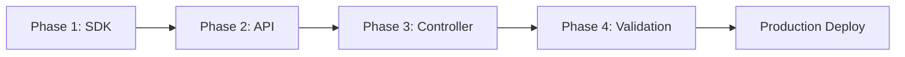

# Alert Controller - Implementation Plan

**Document Version**: 1.0
**Last Updated**: 2025-10-23
**Status**: Draft
**Related Documents**:
- [alert-controller-p1-architecture.md](./alert-controller-p1-architecture.md) - Architecture & Current State
- [alert-controller-api-first-refactoring.md](./alert-controller-api-first-refactoring.md) - Refactoring Strategy

---

## Executive Summary

This implementation plan provides a step-by-step guide for refactoring the alert-controller to comply with the API-first architecture mandate. The plan covers:

- **4-week phased implementation** with clear deliverables per week
- **Development standards** aligned with nexmonyx coding practices
- **Quality gates** ensuring production readiness at each phase
- **Resource allocation** and timeline estimates
- **Risk mitigation** strategies and rollback procedures

**Critical Success Factors**:
1. All 6 database access violations resolved
2. 8 new SDK methods implemented and tested
3. Zero degradation in alert evaluation performance
4. Backward compatibility maintained throughout migration
5. Comprehensive test coverage (>80%) achieved

---

## Table of Contents

1. [Implementation Roadmap](#implementation-roadmap)
2. [Phase 1: SDK Enhancement (Week 1)](#phase-1-sdk-enhancement-week-1)
3. [Phase 2: API Server Enhancements (Week 2)](#phase-2-api-server-enhancements-week-2)
4. [Phase 3: Controller Refactoring (Week 3)](#phase-3-controller-refactoring-week-3)
5. [Phase 4: Validation & Deployment (Week 4)](#phase-4-validation-deployment-week-4)
6. [Development Standards](#development-standards)
7. [Quality Gates & Testing](#quality-gates-testing)
8. [Resource Requirements](#resource-requirements)
9. [Timeline & Milestones](#timeline-milestones)
10. [Risk Mitigation](#risk-mitigation)
11. [Rollback Procedures](#rollback-procedures)

---

## Implementation Roadmap

### Overview

The implementation follows a **bottom-up approach**: SDK → API → Controller, ensuring each layer is stable before building the next.

```
Week 1: SDK Enhancement
├── Add 8 new methods
├── Unit tests (>80% coverage)
├── Integration tests with mock API
└── Tag release: v2.x.0

Week 2: API Server Enhancements
├── Implement 5 new endpoints
├── Handler refactoring (single-function-per-file)
├── Swagger documentation
└── Deploy to dev environment

Week 3: Controller Refactoring
├── Replace 6 database access points
├── Implement SDK client pattern
├── Maintain backward compatibility
└── Deploy to dev environment

Week 4: Validation & Deployment
├── Performance testing (vs baseline)
├── Integration testing (E2E scenarios)
├── Staging deployment
└── Production rollout (staged)
```

### Phase Dependencies



**BLOCKER RULE**: No phase can begin until previous phase passes quality gates.

---

## Phase 1: SDK Enhancement (Week 1)

### Objectives

1. Implement 8 new SDK methods for alert-controller API access
2. Achieve >80% test coverage for new methods
3. Validate integration with mock API server
4. Tag and release new SDK version

### Tasks Breakdown

#### Task 1.1: Alert Instances CRUD (2 days)

**Location**: `/home/mmattox/go/src/github.com/nexmonyx/go-sdk/alerts.go`

**New Methods to Implement**:

```go
// ListInstances retrieves alert instances with filtering and pagination
func (s *AlertsService) ListInstances(ctx context.Context, opts *ListOptions) ([]*AlertInstance, *PaginationMeta, error) {
    // Implementation steps:
    // 1. Build query parameters from opts (filters, pagination)
    // 2. Make GET request to /api/v1/alerts/instances
    // 3. Parse response into AlertInstance slice
    // 4. Extract pagination metadata
    // 5. Return results with error handling
}

// GetInstance retrieves a specific alert instance by ID
func (s *AlertsService) GetInstance(ctx context.Context, id uint) (*AlertInstance, error) {
    // Implementation steps:
    // 1. Validate id parameter (non-zero)
    // 2. Make GET request to /api/v1/alerts/instances/{id}
    // 3. Parse response into AlertInstance struct
    // 4. Handle 404 with ErrNotFound error
    // 5. Return result with error handling
}

// CreateInstance creates a new alert instance
func (s *AlertsService) CreateInstance(ctx context.Context, instance *AlertInstance) (*AlertInstance, error) {
    // Implementation steps:
    // 1. Validate required fields (RuleID, ServerID, State, Severity)
    // 2. Make POST request to /api/v1/alerts/instances
    // 3. Send instance as JSON body
    // 4. Parse response into AlertInstance struct
    // 5. Return created instance with error handling
}

// UpdateInstance updates an existing alert instance
func (s *AlertsService) UpdateInstance(ctx context.Context, id uint, updates map[string]interface{}) error {
    // Implementation steps:
    // 1. Validate id parameter (non-zero)
    // 2. Validate updates map (non-empty, allowed fields only)
    // 3. Make PATCH request to /api/v1/alerts/instances/{id}
    // 4. Send updates as JSON body
    // 5. Handle 404, 400 errors appropriately
    // 6. Return error status
}

// ResolveInstance marks an alert instance as resolved
func (s *AlertsService) ResolveInstance(ctx context.Context, id uint, resolvedBy string) error {
    // Implementation steps:
    // 1. Validate id parameter and resolvedBy string
    // 2. Make POST request to /api/v1/alerts/instances/{id}/resolve
    // 3. Send resolution metadata as JSON body
    // 4. Handle state transition errors (can't resolve if not firing)
    // 5. Return error status
}
```

**Testing Requirements**:
- Unit tests for each method (happy path)
- Error handling tests (401, 403, 404, 500)
- Validation tests (invalid parameters)
- Mock API server integration tests

**Acceptance Criteria**:
- [ ] All 5 methods implemented following SDK patterns
- [ ] >80% code coverage for new methods
- [ ] All tests passing in CI/CD
- [ ] Code review approved by senior engineer

#### Task 1.2: Server Scope Query (1 day)

**Location**: `/home/mmattox/go/src/github.com/nexmonyx/go-sdk/servers.go`

**New Method to Implement**:

```go
// ListInScope retrieves servers matching a scope query for alert evaluation
func (s *ServersService) ListInScope(ctx context.Context, query *ScopeQuery) ([]*Server, error) {
    // Implementation steps:
    // 1. Validate ScopeQuery parameters
    // 2. Build query string from scope criteria:
    //    - organization scope: all servers
    //    - group scope: servers in specific group
    //    - tag scope: servers with specific tags
    //    - server scope: specific server by ID
    // 3. Make GET request to /api/v1/servers/scope
    // 4. Parse response into Server slice
    // 5. Return results with error handling
}
```

**ScopeQuery Structure**:

```go
type ScopeQuery struct {
    ScopeType  string   `json:"scope_type"`  // organization|group|tag|server
    ScopeIDs   []uint   `json:"scope_ids"`   // IDs based on scope type
    TagFilters []string `json:"tag_filters"` // Optional tag filters
    Active     *bool    `json:"active"`      // Optional: filter by active status
}
```

**Testing Requirements**:
- Unit tests for all scope types
- Edge cases (empty scope, invalid scope type)
- Pagination handling
- Tag filter combinations

**Acceptance Criteria**:
- [ ] Method implemented with comprehensive validation
- [ ] All scope types tested (organization, group, tag, server)
- [ ] >80% code coverage
- [ ] Integration test with mock API

#### Task 1.3: Metrics Query & Aggregation (1.5 days)

**Location**: `/home/mmattox/go/src/github.com/nexmonyx/go-sdk/metrics.go`

**New Methods to Implement**:

```go
// Query retrieves metric data points for alert evaluation
func (s *MetricsService) Query(ctx context.Context, query *MetricsQuery) ([]*MetricDataPoint, error) {
    // Implementation steps:
    // 1. Validate MetricsQuery parameters
    // 2. Build query string with time range, metric names, server IDs
    // 3. Make GET request to /api/v1/metrics/query
    // 4. Parse response into MetricDataPoint slice
    // 5. Handle time zone conversions
    // 6. Return results with error handling
}

// Aggregate computes aggregated metric values across servers
func (s *MetricsService) Aggregate(ctx context.Context, query *AggregateQuery) (map[uint]float64, error) {
    // Implementation steps:
    // 1. Validate AggregateQuery parameters
    // 2. Build query string with aggregation type, time window, server IDs
    // 3. Make GET request to /api/v1/metrics/aggregate
    // 4. Parse response into map[serverID]value
    // 5. Handle empty results gracefully
    // 6. Return aggregated values with error handling
}
```

**Query Structures**:

```go
type MetricsQuery struct {
    ServerIDs   []uint    `json:"server_ids"`
    MetricNames []string  `json:"metric_names"`
    StartTime   time.Time `json:"start_time"`
    EndTime     time.Time `json:"end_time"`
    Resolution  string    `json:"resolution"`  // 1m, 5m, 15m, 1h
}

type AggregateQuery struct {
    ServerIDs      []uint    `json:"server_ids"`
    MetricName     string    `json:"metric_name"`
    Aggregation    string    `json:"aggregation"`     // avg, max, min, sum, count
    TimeWindowMins int       `json:"time_window_mins"` // Lookback window
}

type MetricDataPoint struct {
    ServerID   uint      `json:"server_id"`
    MetricName string    `json:"metric_name"`
    Value      float64   `json:"value"`
    Timestamp  time.Time `json:"timestamp"`
}
```

**Testing Requirements**:
- Time range validation tests
- Aggregation function tests (avg, max, min, sum, count)
- Empty result handling
- Large dataset performance tests

**Acceptance Criteria**:
- [ ] Both methods implemented with validation
- [ ] All aggregation types tested
- [ ] Performance benchmarks meet requirements (<100ms for 1000 data points)
- [ ] >80% code coverage

#### Task 1.4: SDK Integration Testing (0.5 days)

**Create Mock API Server**:

**Location**: `/home/mmattox/go/src/github.com/nexmonyx/go-sdk/tests/integration/docker/cmd/main.go`

**Enhancement Required**:

```go
// Add new endpoints to MockAPIServer for alert-controller testing

// Alert Instances endpoints
mux.HandleFunc("/api/v1/alerts/instances", m.handleAlertInstances)
mux.HandleFunc("/api/v1/alerts/instances/", m.handleAlertInstanceDetail)

// Server scope endpoint
mux.HandleFunc("/api/v1/servers/scope", m.handleServersScope)

// Metrics endpoints
mux.HandleFunc("/api/v1/metrics/query", m.handleMetricsQuery)
mux.HandleFunc("/api/v1/metrics/aggregate", m.handleMetricsAggregate)
```

**Integration Test Suite**:

**Location**: `/home/mmattox/go/src/github.com/nexmonyx/go-sdk/tests/integration/alerts_test.go`

```go
func TestAlertInstancesIntegration(t *testing.T) {
    // Test scenarios:
    // 1. Create alert instance
    // 2. List alert instances with filters
    // 3. Get specific instance
    // 4. Update instance state
    // 5. Resolve instance
    // 6. Error handling (404, 401, etc.)
}

func TestServerScopeIntegration(t *testing.T) {
    // Test scenarios:
    // 1. Organization scope query
    // 2. Group scope query
    // 3. Tag scope query
    // 4. Server scope query
    // 5. Combined filters
}

func TestMetricsIntegration(t *testing.T) {
    // Test scenarios:
    // 1. Query raw metrics
    // 2. Aggregate metrics (all types)
    // 3. Time range filtering
    // 4. Performance with large datasets
}
```

**Acceptance Criteria**:
- [ ] Mock API server supports all new endpoints
- [ ] Integration tests cover all success paths
- [ ] Integration tests cover error scenarios
- [ ] Tests pass in CI/CD environment

#### Task 1.5: SDK Documentation & Release (0.5 days)

**Update README.md**:

**Location**: `/home/mmattox/go/src/github.com/nexmonyx/go-sdk/README.md`

Add usage examples for new methods:

```markdown
### Alert Instances

#### List Alert Instances
```go
instances, meta, err := client.Alerts.ListInstances(ctx, &nexmonyx.ListOptions{
    Filters: map[string]interface{}{
        "state": "firing",
        "severity": "critical",
    },
    Page:     1,
    PageSize: 20,
})
```

#### Create Alert Instance
```go
instance := &nexmonyx.AlertInstance{
    RuleID:   123,
    ServerID: 456,
    State:    "firing",
    Severity: "warning",
    Value:    85.5,
}
created, err := client.Alerts.CreateInstance(ctx, instance)
```

#### Resolve Alert Instance
```go
err := client.Alerts.ResolveInstance(ctx, instanceID, "auto-resolved")
```

### Server Scope Queries

```go
query := &nexmonyx.ScopeQuery{
    ScopeType: "tag",
    TagFilters: []string{"production", "web"},
    Active: nexmonyx.Bool(true),
}
servers, err := client.Servers.ListInScope(ctx, query)
```

### Metrics Queries

```go
// Query raw metrics
query := &nexmonyx.MetricsQuery{
    ServerIDs:   []uint{1, 2, 3},
    MetricNames: []string{"cpu_usage", "memory_usage"},
    StartTime:   time.Now().Add(-1 * time.Hour),
    EndTime:     time.Now(),
    Resolution:  "5m",
}
dataPoints, err := client.Metrics.Query(ctx, query)

// Aggregate metrics
aggQuery := &nexmonyx.AggregateQuery{
    ServerIDs:      []uint{1, 2, 3},
    MetricName:     "cpu_usage",
    Aggregation:    "avg",
    TimeWindowMins: 15,
}
values, err := client.Metrics.Aggregate(ctx, aggQuery)
```
```

**Version Tagging**:

```bash
cd /home/mmattox/go/src/github.com/nexmonyx/go-sdk

# Commit all changes
git add .
git commit -m "feat: add alert-controller API support

- Add AlertInstance CRUD methods
- Add server scope query support
- Add metrics query and aggregation methods
- Add comprehensive integration tests
- Update documentation with usage examples

Related to: alert-controller API-first refactoring

🤖 Generated with Claude Code"

# Tag new minor version (breaking changes = major, features = minor, fixes = patch)
git tag v2.4.0
git push origin main --tags
```

**Acceptance Criteria**:
- [ ] README.md updated with all new methods
- [ ] Usage examples provided for each method
- [ ] Changelog updated with release notes
- [ ] Version tagged and pushed to GitHub
- [ ] GitHub release created with notes

### Phase 1 Quality Gate

**Before proceeding to Phase 2, verify**:

| Requirement | Verification Command | Expected Result |
|-------------|---------------------|-----------------|
| Build passes | `make build` | No errors |
| Tests pass | `make test` | All tests green, >80% coverage |
| Lint clean | `make lint` | No lint errors |
| Integration tests | `make test-integration` | All integration tests pass |
| Documentation complete | Manual review | README updated, examples clear |
| Version tagged | `git describe --tags` | v2.4.0 or higher |

**Phase 1 BLOCKER**: If any quality gate check fails, Phase 2 CANNOT begin.

---

## Phase 2: API Server Enhancements (Week 2)

### Objectives

1. Implement 5 new API endpoints for alert-controller
2. Refactor handlers to single-function-per-file pattern
3. Add comprehensive Swagger documentation
4. Deploy to dev environment for validation

### Tasks Breakdown

#### Task 2.1: Alert Instances API Endpoints (2.5 days)

**Create Handler Directory Structure**:

```bash
mkdir -p /home/mmattox/go/src/github.com/nexmonyx/nexmonyx/pkg/api/handlers/alerts/instances/
```

**Required Files**:

1. **helpers.go** - Logger and shared utilities
2. **list_instances.go** - GET /api/v1/alerts/instances
3. **get_instance.go** - GET /api/v1/alerts/instances/:id
4. **create_instance.go** - POST /api/v1/alerts/instances
5. **update_instance.go** - PATCH /api/v1/alerts/instances/:id
6. **resolve_instance.go** - POST /api/v1/alerts/instances/:id/resolve

**Implementation Pattern** (example for list_instances.go):

```go
package instances

import (
    "github.com/gofiber/fiber/v2"
    nexerrors "github.com/nexmonyx/nexmonyx/pkg/errors"
    "github.com/nexmonyx/nexmonyx/pkg/logging"
    "github.com/nexmonyx/nexmonyx/pkg/models"
    "github.com/nexmonyx/nexmonyx/pkg/utils"
)

// ListInstances retrieves alert instances with filtering and pagination
// @Summary List alert instances
// @Description Retrieves a paginated list of alert instances with optional filtering by state, severity, rule, and server
// @Tags Alerts
// @Produce json
// @Param state query string false "Filter by state (pending, firing, resolved, silenced)"
// @Param severity query string false "Filter by severity (info, warning, critical)"
// @Param rule_id query integer false "Filter by rule ID"
// @Param server_id query integer false "Filter by server ID"
// @Param page query integer false "Page number (default: 1)"
// @Param page_size query integer false "Page size (default: 20, max: 100)"
// @Success 200 {object} utils.Response{data=[]models.AlertInstance,meta=utils.PaginationMeta}
// @Failure 400 {object} errors.ErrorResponse "Invalid parameters"
// @Failure 401 {object} errors.ErrorResponse "User not authenticated"
// @Failure 403 {object} errors.ErrorResponse "Access denied"
// @Failure 500 {object} errors.ErrorResponse "Internal server error"
// @Security ApiKeyAuth
// @Router /v1/alerts/instances [get]
func ListInstances(c *fiber.Ctx) error {
    if instanceLogger.ShouldTrace("ListInstances") {
        instanceLogger.Trace(c, "ListInstances", "Processing request")
    }

    // Get user and organization context
    user := c.Locals("user").(*models.User)
    if user == nil {
        return nexerrors.Unauthorized(c, "User not authenticated", "Valid authentication required")
    }

    orgID := utils.GetOrganizationID(c)
    if orgID == 0 {
        return nexerrors.Forbidden(c, "Organization context required", "Request must include organization context")
    }

    // Parse query parameters
    query := utils.DB.Where("organization_id = ?", orgID)

    // State filter
    if state := c.Query("state"); state != "" {
        validStates := map[string]bool{"pending": true, "firing": true, "resolved": true, "silenced": true}
        if !validStates[state] {
            return nexerrors.BadRequest(c, "Invalid state", "State must be one of: pending, firing, resolved, silenced")
        }
        query = query.Where("state = ?", state)
    }

    // Severity filter
    if severity := c.Query("severity"); severity != "" {
        validSeverities := map[string]bool{"info": true, "warning": true, "critical": true}
        if !validSeverities[severity] {
            return nexerrors.BadRequest(c, "Invalid severity", "Severity must be one of: info, warning, critical")
        }
        query = query.Where("severity = ?", severity)
    }

    // Rule ID filter
    if ruleID := c.QueryInt("rule_id"); ruleID > 0 {
        query = query.Where("rule_id = ?", ruleID)
    }

    // Server ID filter
    if serverID := c.QueryInt("server_id"); serverID > 0 {
        query = query.Where("server_id = ?", serverID)
    }

    // Pagination
    page := utils.GetPageNumber(c)
    pageSize := utils.GetPageSize(c)
    offset := (page - 1) * pageSize

    // Get total count
    var total int64
    if err := query.Model(&models.AlertInstance{}).Count(&total).Error; err != nil {
        instanceLogger.Error(c, "ListInstances", "Failed to count instances: %v", err)
        return nexerrors.InternalServerError(c, "Failed to retrieve alert instances", err.Error())
    }

    // Get instances
    var instances []models.AlertInstance
    if err := query.Preload("Rule").Preload("Server").
        Order("fired_at DESC").
        Limit(pageSize).Offset(offset).
        Find(&instances).Error; err != nil {
        instanceLogger.Error(c, "ListInstances", "Failed to query instances: %v", err)
        return nexerrors.InternalServerError(c, "Failed to retrieve alert instances", err.Error())
    }

    if instanceLogger.ShouldTrace("ListInstances") {
        instanceLogger.Trace(c, "ListInstances", "Retrieved %d instances", len(instances))
    }

    // Build pagination metadata
    meta := utils.BuildPaginationMeta(total, page, pageSize)

    return utils.SendSuccessResponse(c, fiber.StatusOK, fiber.Map{
        "data": instances,
        "meta": meta,
    }, "Alert instances retrieved successfully")
}
```

**Acceptance Criteria (per endpoint)**:
- [ ] Single-function-per-file pattern followed
- [ ] Comprehensive trace and debug logging
- [ ] Complete Swagger documentation
- [ ] All error cases use nexerrors.* functions
- [ ] Proper authentication and authorization checks
- [ ] Input validation with meaningful error messages
- [ ] Pagination support (for list endpoints)
- [ ] Preloading of related entities

#### Task 2.2: Server Scope API Endpoint (0.5 days)

**Handler Location**: `/home/mmattox/go/src/github.com/nexmonyx/nexmonyx/pkg/api/handlers/servers/scope/list_in_scope.go`

**Endpoint**: GET /api/v1/servers/scope

**Implementation**:

```go
// ListInScope retrieves servers matching a scope query for alert evaluation
// @Summary List servers in scope
// @Description Retrieves servers matching scope criteria (organization, group, tag, server)
// @Tags Servers
// @Produce json
// @Param scope_type query string true "Scope type (organization, group, tag, server)"
// @Param scope_ids query []int false "Scope IDs (comma-separated)"
// @Param tag_filters query []string false "Tag filters (comma-separated)"
// @Param active query boolean false "Filter by active status"
// @Success 200 {object} utils.Response{data=[]models.Server}
// @Failure 400 {object} errors.ErrorResponse "Invalid scope parameters"
// @Failure 401 {object} errors.ErrorResponse "User not authenticated"
// @Failure 403 {object} errors.ErrorResponse "Access denied"
// @Failure 500 {object} errors.ErrorResponse "Internal server error"
// @Security ApiKeyAuth
// @Router /v1/servers/scope [get]
func ListInScope(c *fiber.Ctx) error {
    // Implementation pattern similar to ListInstances
    // with scope-specific query building logic
}
```

**Scope Query Logic**:

```go
func buildScopeQuery(orgID uint, scopeType string, scopeIDs []uint, tagFilters []string, active *bool) (*gorm.DB, error) {
    query := utils.DB.Where("organization_id = ?", orgID)

    switch scopeType {
    case "organization":
        // No additional filtering - all servers in org
    case "group":
        if len(scopeIDs) == 0 {
            return nil, errors.New("group scope requires scope_ids")
        }
        query = query.Where("group_id IN ?", scopeIDs)
    case "tag":
        // Join with server_tags table
        if len(tagFilters) == 0 {
            return nil, errors.New("tag scope requires tag_filters")
        }
        query = query.Joins("JOIN server_tags ON servers.id = server_tags.server_id").
            Where("server_tags.tag_name IN ?", tagFilters)
    case "server":
        if len(scopeIDs) == 0 {
            return nil, errors.New("server scope requires scope_ids")
        }
        query = query.Where("id IN ?", scopeIDs)
    default:
        return nil, fmt.Errorf("invalid scope_type: %s", scopeType)
    }

    // Optional active filter
    if active != nil {
        query = query.Where("active = ?", *active)
    }

    return query, nil
}
```

**Acceptance Criteria**:
- [ ] All 4 scope types implemented and tested
- [ ] Tag filter joins working correctly
- [ ] Proper error messages for missing required parameters
- [ ] Swagger documentation complete

#### Task 2.3: Metrics Query API Endpoints (1 day)

**Handler Locations**:
- `/home/mmattox/go/src/github.com/nexmonyx/nexmonyx/pkg/api/handlers/metrics/query/query_metrics.go`
- `/home/mmattox/go/src/github.com/nexmonyx/nexmonyx/pkg/api/handlers/metrics/aggregation/aggregate_metrics.go`

**Endpoint 1**: GET /api/v1/metrics/query

```go
// QueryMetrics retrieves metric data points for alert evaluation
// @Summary Query metrics
// @Description Retrieves raw metric data points with time range and resolution
// @Tags Metrics
// @Produce json
// @Param server_ids query []int true "Server IDs (comma-separated)"
// @Param metric_names query []string true "Metric names (comma-separated)"
// @Param start_time query string true "Start time (RFC3339)"
// @Param end_time query string true "End time (RFC3339)"
// @Param resolution query string false "Resolution (1m, 5m, 15m, 1h, default: 5m)"
// @Success 200 {object} utils.Response{data=[]models.MetricDataPoint}
// @Failure 400 {object} errors.ErrorResponse "Invalid parameters"
// @Failure 401 {object} errors.ErrorResponse "User not authenticated"
// @Failure 500 {object} errors.ErrorResponse "Internal server error"
// @Security ApiKeyAuth
// @Router /v1/metrics/query [get]
func QueryMetrics(c *fiber.Ctx) error {
    // Parse server_ids, metric_names, time range, resolution
    // Query TimescaleDB metrics tables
    // Apply time bucket for resolution
    // Return data points
}
```

**Endpoint 2**: GET /api/v1/metrics/aggregate

```go
// AggregateMetrics computes aggregated metric values
// @Summary Aggregate metrics
// @Description Computes aggregated values (avg, max, min, sum, count) for metrics
// @Tags Metrics
// @Produce json
// @Param server_ids query []int true "Server IDs (comma-separated)"
// @Param metric_name query string true "Metric name"
// @Param aggregation query string true "Aggregation type (avg, max, min, sum, count)"
// @Param time_window_mins query integer true "Time window in minutes"
// @Success 200 {object} utils.Response{data=map[uint]float64} "Map of server_id to aggregated value"
// @Failure 400 {object} errors.ErrorResponse "Invalid parameters"
// @Failure 401 {object} errors.ErrorResponse "User not authenticated"
// @Failure 500 {object} errors.ErrorResponse "Internal server error"
// @Security ApiKeyAuth
// @Router /v1/metrics/aggregate [get]
func AggregateMetrics(c *fiber.Ctx) error {
    // Parse parameters
    // Build aggregation query based on metric type
    // Use TimescaleDB time bucket and aggregation functions
    // Return map of server_id => aggregated_value
}
```

**TimescaleDB Query Examples**:

```sql
-- Query raw metrics with resolution
SELECT
    time_bucket('5 minutes', timestamp) AS bucket,
    server_id,
    metric_name,
    AVG(value) AS value
FROM metrics.data_points
WHERE server_id = ANY($1)
  AND metric_name = ANY($2)
  AND timestamp BETWEEN $3 AND $4
GROUP BY bucket, server_id, metric_name
ORDER BY bucket DESC;

-- Aggregate metrics with time window
SELECT
    server_id,
    AVG(value) AS avg_value
FROM metrics.data_points
WHERE server_id = ANY($1)
  AND metric_name = $2
  AND timestamp >= NOW() - INTERVAL '15 minutes'
GROUP BY server_id;
```

**Acceptance Criteria**:
- [ ] Both endpoints implemented and tested
- [ ] TimescaleDB time bucket queries optimized
- [ ] All aggregation types (avg, max, min, sum, count) working
- [ ] Time range validation prevents excessive queries
- [ ] Resolution parameter applied correctly

#### Task 2.4: Routes Registration (0.5 days)

**Update Routes**: `/home/mmattox/go/src/github.com/nexmonyx/nexmonyx/pkg/routes/routes.go`

```go
import (
    alertInstances "github.com/nexmonyx/nexmonyx/pkg/api/handlers/alerts/instances"
    serverScope "github.com/nexmonyx/nexmonyx/pkg/api/handlers/servers/scope"
    metricsQuery "github.com/nexmonyx/nexmonyx/pkg/api/handlers/metrics/query"
    metricsAgg "github.com/nexmonyx/nexmonyx/pkg/api/handlers/metrics/aggregation"
)

func SetupRoutes(app *fiber.App) {
    // ... existing routes ...

    // Alert instances endpoints
    v1.Get("/alerts/instances", middleware.RequireAuth(), alertInstances.ListInstances)
    v1.Get("/alerts/instances/:id", middleware.RequireAuth(), alertInstances.GetInstance)
    v1.Post("/alerts/instances", middleware.RequireAuth(), alertInstances.CreateInstance)
    v1.Patch("/alerts/instances/:id", middleware.RequireAuth(), alertInstances.UpdateInstance)
    v1.Post("/alerts/instances/:id/resolve", middleware.RequireAuth(), alertInstances.ResolveInstance)

    // Server scope endpoint
    v1.Get("/servers/scope", middleware.RequireAuth(), serverScope.ListInScope)

    // Metrics query endpoints
    v1.Get("/metrics/query", middleware.RequireAuth(), metricsQuery.QueryMetrics)
    v1.Get("/metrics/aggregate", middleware.RequireAuth(), metricsAgg.AggregateMetrics)
}
```

**Acceptance Criteria**:
- [ ] All routes registered with proper middleware
- [ ] Authentication required for all endpoints
- [ ] Routes tested with curl/Postman

#### Task 2.5: Swagger Generation & Deployment (0.5 days)

**Generate Swagger Docs**:

```bash
cd /home/mmattox/go/src/github.com/nexmonyx/nexmonyx
make generate-swagger
```

**Validate Swagger**:
- [ ] All new endpoints appear in /api/docs
- [ ] Request/response schemas correct
- [ ] Examples provided for complex parameters
- [ ] Error responses documented

**Deploy to Dev**:

```bash
# Build and test locally first
make build-api-local
make test-api-local

# Commit changes
git add pkg/api/handlers/alerts/instances/
git add pkg/api/handlers/servers/scope/
git add pkg/api/handlers/metrics/
git add pkg/routes/routes.go
git add docs/swagger/

git commit -m "feat(api): add alert-controller endpoints

- Add alert instances CRUD endpoints
- Add server scope query endpoint
- Add metrics query and aggregation endpoints
- Update Swagger documentation
- Follow single-function-per-file pattern

Related to: alert-controller API-first refactoring (Phase 2)

🤖 Generated with Claude Code"

# Push to main (triggers ArgoCD sync to dev)
git push origin main
```

**Verify Dev Deployment**:

```bash
# Check ArgoCD sync status
argocd app get nexmonyx-dev

# Test endpoints in dev
curl -H "Authorization: Bearer $DEV_TOKEN" \
  https://api-dev.nexmonyx.com/api/v1/alerts/instances

curl -H "Authorization: Bearer $DEV_TOKEN" \
  https://api-dev.nexmonyx.com/api/v1/servers/scope?scope_type=organization

curl -H "Authorization: Bearer $DEV_TOKEN" \
  "https://api-dev.nexmonyx.com/api/v1/metrics/query?server_ids=1,2,3&metric_names=cpu_usage&start_time=2025-10-23T00:00:00Z&end_time=2025-10-23T01:00:00Z"
```

**Acceptance Criteria**:
- [ ] Swagger docs generated successfully
- [ ] Deployment to dev environment successful
- [ ] All endpoints responding with 200/401 status
- [ ] No errors in API server logs

### Phase 2 Quality Gate

| Requirement | Verification | Expected Result |
|-------------|--------------|-----------------|
| All handlers created | File count check | 8 handler files |
| Swagger complete | Visit /api/docs | All endpoints documented |
| Build passes | `make build-api-local` | No errors |
| Tests pass | `make test-api-local` | All tests green |
| Dev deployment | ArgoCD status | Synced, healthy |
| Endpoint smoke tests | curl commands | All respond correctly |

**Phase 2 BLOCKER**: If any quality gate check fails, Phase 3 CANNOT begin.

---

## Phase 3: Controller Refactoring (Week 3)

### Objectives

1. Replace all 6 direct database access points with SDK calls
2. Implement SDK client initialization and authentication pattern
3. Maintain backward compatibility and feature parity
4. Deploy refactored controller to dev environment
5. Validate no performance degradation

### Tasks Breakdown

#### Task 3.1: SDK Client Integration (0.5 days)

**Update Controller Main**: `/home/mmattox/go/src/github.com/nexmonyx/nexmonyx/cmd/alert-controller/main.go`

**Remove Direct Database Connection**:

```go
// BEFORE (lines 42-47) - REMOVE THIS
db, err := gorm.Open(postgres.Open(config.DatabaseURL), &gorm.Config{})
if err != nil {
    return nil, fmt.Errorf("failed to connect to database: %w", err)
}
config.DB = db
```

**Add SDK Client Initialization**:

```go
import (
    "github.com/nexmonyx/go-sdk"
)

// Initialize SDK client for API access
sdkClient, err := nexmonyx.NewClient(&nexmonyx.Config{
    BaseURL: config.APIURL,  // e.g., "https://api-dev.nexmonyx.com"
    Auth: nexmonyx.AuthConfig{
        APIKey:    config.APIKey,
        APISecret: config.APISecret,
    },
    Timeout: 30 * time.Second,
    Retry: nexmonyx.RetryConfig{
        MaxRetries:  3,
        RetryWaitMin: 1 * time.Second,
        RetryWaitMax: 5 * time.Second,
    },
    Logger: logger,  // Use controller's logger
})
if err != nil {
    return nil, fmt.Errorf("failed to initialize SDK client: %w", err)
}
config.SDKClient = sdkClient
```

**Update Config Struct**:

```go
type Config struct {
    OrganizationID uint              // Organization this controller manages
    APIURL         string            // Nexmonyx API URL
    APIKey         string            // API authentication key
    APISecret      string            // API authentication secret
    SDKClient      *nexmonyx.Client  // SDK client instance
    Logger         *logging.Logger   // Controller logger
    // Remove: DB *gorm.DB (no longer needed)
}
```

**Environment Variables**:

```bash
# Update deployment configuration
NEXMONYX_API_URL=https://api-dev.nexmonyx.com
NEXMONYX_API_KEY=<controller-api-key>
NEXMONYX_API_SECRET=<controller-api-secret>
ORGANIZATION_ID=<org-id>
```

**Acceptance Criteria**:
- [ ] SDK client initialized successfully on startup
- [ ] Authentication credentials loaded from environment
- [ ] Database connection code removed
- [ ] Config struct updated
- [ ] Logging integrated with SDK client

#### Task 3.2: Alert Evaluation Engine Refactoring (2 days)

**File**: `/home/mmattox/go/src/github.com/nexmonyx/nexmonyx/pkg/alerts/controller/evaluator.go`

**Current Implementation** (lines 195-210 - DIRECT DB):

```go
// ❌ VIOLATION: Direct database DELETE
func (e *Evaluator) cleanupOldInstances(ctx context.Context) error {
    threshold := time.Now().Add(-24 * time.Hour)
    result := e.config.DB.
        Where("state = ? AND resolved_at < ?", "resolved", threshold).
        Delete(&models.AlertInstance{})

    if result.Error != nil {
        return fmt.Errorf("failed to cleanup old instances: %w", result.Error)
    }

    e.logger.Info(ctx, "CleanupOldInstances", "Deleted %d old instances", result.RowsAffected)
    return nil
}
```

**Refactored Implementation** (API-FIRST):

```go
// ✅ COMPLIANT: Use SDK for cleanup
func (e *Evaluator) cleanupOldInstances(ctx context.Context) error {
    threshold := time.Now().Add(-24 * time.Hour)

    // List resolved instances older than threshold
    instances, _, err := e.config.SDKClient.Alerts.ListInstances(ctx, &nexmonyx.ListOptions{
        Filters: map[string]interface{}{
            "state": "resolved",
            "resolved_before": threshold.Format(time.RFC3339),
        },
        PageSize: 100,  // Process in batches
    })

    if err != nil {
        return fmt.Errorf("failed to list old instances: %w", err)
    }

    // Delete instances via API
    deleted := 0
    for _, instance := range instances {
        if err := e.config.SDKClient.Alerts.Delete(ctx, instance.ID); err != nil {
            e.logger.Warn(ctx, "CleanupOldInstances", "Failed to delete instance %d: %v", instance.ID, err)
            continue
        }
        deleted++
    }

    e.logger.Info(ctx, "CleanupOldInstances", "Deleted %d old instances", deleted)
    return nil
}
```

**Additional Refactorings Required**:

1. **getAlertStatus** (lines 224-243):

```go
// BEFORE: Direct SELECT query
func (e *Evaluator) getAlertStatus(ruleID uint) (*AlertStatus, error) {
    var instance models.AlertInstance
    err := e.config.DB.
        Where("rule_id = ? AND state IN ?", ruleID, []string{"pending", "firing"}).
        Order("fired_at DESC").
        First(&instance).Error
    // ...
}

// AFTER: Use SDK
func (e *Evaluator) getAlertStatus(ctx context.Context, ruleID uint) (*AlertStatus, error) {
    instances, _, err := e.config.SDKClient.Alerts.ListInstances(ctx, &nexmonyx.ListOptions{
        Filters: map[string]interface{}{
            "rule_id": ruleID,
            "state": []string{"pending", "firing"},
        },
        Sort:     "fired_at",
        Order:    "desc",
        PageSize: 1,
    })

    if err != nil {
        return nil, fmt.Errorf("failed to get alert status: %w", err)
    }

    if len(instances) == 0 {
        return &AlertStatus{State: "ok"}, nil
    }

    return &AlertStatus{
        State:      instances[0].State,
        Severity:   instances[0].Severity,
        InstanceID: instances[0].ID,
        FiredAt:    instances[0].FiredAt,
    }, nil
}
```

2. **getActiveAlerts** (lines 254-263):

```go
// BEFORE: Direct SELECT
func (e *Evaluator) getActiveAlerts() ([]models.AlertInstance, error) {
    var instances []models.AlertInstance
    err := e.config.DB.
        Where("state IN ?", []string{"pending", "firing"}).
        Preload("Rule").
        Preload("Server").
        Find(&instances).Error
    return instances, err
}

// AFTER: Use SDK with pagination
func (e *Evaluator) getActiveAlerts(ctx context.Context) ([]models.AlertInstance, error) {
    var allInstances []models.AlertInstance
    page := 1

    for {
        instances, meta, err := e.config.SDKClient.Alerts.ListInstances(ctx, &nexmonyx.ListOptions{
            Filters: map[string]interface{}{
                "state": []string{"pending", "firing"},
            },
            Page:     page,
            PageSize: 100,
        })

        if err != nil {
            return nil, fmt.Errorf("failed to get active alerts: %w", err)
        }

        allInstances = append(allInstances, instances...)

        if page >= meta.TotalPages {
            break
        }
        page++
    }

    return allInstances, nil
}
```

3. **acknowledgeAlert** (lines 272-280):

```go
// BEFORE: Direct UPDATE
func (e *Evaluator) acknowledgeAlert(instanceID uint, acknowledgedBy string) error {
    return e.config.DB.Model(&models.AlertInstance{}).
        Where("id = ?", instanceID).
        Updates(map[string]interface{}{
            "acknowledged_at": time.Now(),
            "acknowledged_by": acknowledgedBy,
        }).Error
}

// AFTER: Use SDK
func (e *Evaluator) acknowledgeAlert(ctx context.Context, instanceID uint, acknowledgedBy string) error {
    return e.config.SDKClient.Alerts.Acknowledge(ctx, instanceID, acknowledgedBy)
}
```

4. **resolveAlert** (lines 300-315):

```go
// BEFORE: Direct UPDATE
func (e *Evaluator) resolveAlert(instanceID uint, resolvedBy string) error {
    return e.config.DB.Model(&models.AlertInstance{}).
        Where("id = ?", instanceID).
        Updates(map[string]interface{}{
            "state":       "resolved",
            "resolved_at": time.Now(),
            "resolved_by": resolvedBy,
        }).Error
}

// AFTER: Use SDK
func (e *Evaluator) resolveAlert(ctx context.Context, instanceID uint, resolvedBy string) error {
    return e.config.SDKClient.Alerts.ResolveInstance(ctx, instanceID, resolvedBy)
}
```

**Acceptance Criteria**:
- [ ] All 5 database access methods refactored
- [ ] Context propagation added to all methods
- [ ] Error handling preserved
- [ ] Logging maintained
- [ ] Unit tests updated for SDK mocking

#### Task 3.3: Metrics Fetching Refactoring (1 day)

**File**: `/home/mmattox/go/src/github.com/nexmonyx/nexmonyx/pkg/alerts/controller/metrics_fetcher.go`

**Current Implementation** (DIRECT DB):

```go
// ❌ VIOLATION: Direct TimescaleDB query
func (f *MetricsFetcher) fetchMetrics(serverIDs []uint, metricName string, windowMins int) (map[uint]float64, error) {
    query := `
        SELECT server_id, AVG(value) as avg_value
        FROM metrics.data_points
        WHERE server_id = ANY($1)
          AND metric_name = $2
          AND timestamp >= NOW() - INTERVAL '%d minutes'
        GROUP BY server_id
    `

    rows, err := f.config.DB.Raw(fmt.Sprintf(query, windowMins), pq.Array(serverIDs), metricName).Rows()
    // ... process rows
}
```

**Refactored Implementation** (API-FIRST):

```go
// ✅ COMPLIANT: Use SDK metrics aggregation
func (f *MetricsFetcher) fetchMetrics(ctx context.Context, serverIDs []uint, metricName string, windowMins int) (map[uint]float64, error) {
    aggQuery := &nexmonyx.AggregateQuery{
        ServerIDs:      serverIDs,
        MetricName:     metricName,
        Aggregation:    "avg",
        TimeWindowMins: windowMins,
    }

    values, err := f.config.SDKClient.Metrics.Aggregate(ctx, aggQuery)
    if err != nil {
        return nil, fmt.Errorf("failed to aggregate metrics: %w", err)
    }

    return values, nil
}
```

**Additional Metrics Methods**:

```go
// Fetch raw metrics for threshold evaluation
func (f *MetricsFetcher) fetchRawMetrics(ctx context.Context, serverIDs []uint, metricName string, startTime, endTime time.Time) ([]*nexmonyx.MetricDataPoint, error) {
    query := &nexmonyx.MetricsQuery{
        ServerIDs:   serverIDs,
        MetricNames: []string{metricName},
        StartTime:   startTime,
        EndTime:     endTime,
        Resolution:  "1m",  // Use 1-minute resolution for alert evaluation
    }

    dataPoints, err := f.config.SDKClient.Metrics.Query(ctx, query)
    if err != nil {
        return nil, fmt.Errorf("failed to query metrics: %w", err)
    }

    return dataPoints, nil
}

// Fetch server list for scope evaluation
func (f *MetricsFetcher) getServersInScope(ctx context.Context, rule *models.AlertRule) ([]uint, error) {
    scopeQuery := &nexmonyx.ScopeQuery{
        ScopeType:  string(rule.ScopeType),
        ScopeIDs:   rule.ScopeIDs,
        TagFilters: rule.TagFilters,
        Active:     nexmonyx.Bool(true),  // Only active servers
    }

    servers, err := f.config.SDKClient.Servers.ListInScope(ctx, scopeQuery)
    if err != nil {
        return nil, fmt.Errorf("failed to get servers in scope: %w", err)
    }

    serverIDs := make([]uint, len(servers))
    for i, server := range servers {
        serverIDs[i] = server.ID
    }

    return serverIDs, nil
}
```

**Acceptance Criteria**:
- [ ] All metrics fetching uses SDK
- [ ] TimescaleDB queries removed
- [ ] Scope resolution uses SDK
- [ ] Performance equivalent to direct DB access
- [ ] Error handling preserved

#### Task 3.4: Alert Instance Management Refactoring (1 day)

**File**: `/home/mmattox/go/src/github.com/nexmonyx/nexmonyx/pkg/alerts/controller/instance_manager.go`

**Create/Update Alert Instance**:

```go
// BEFORE: Direct INSERT/UPDATE
func (m *InstanceManager) createOrUpdateInstance(rule *models.AlertRule, serverID uint, value float64, severity string) error {
    var instance models.AlertInstance
    err := m.config.DB.
        Where("rule_id = ? AND server_id = ? AND state IN ?", rule.ID, serverID, []string{"pending", "firing"}).
        First(&instance).Error

    if err == gorm.ErrRecordNotFound {
        // Create new instance
        instance = models.AlertInstance{
            RuleID:   rule.ID,
            ServerID: serverID,
            State:    "firing",
            Severity: severity,
            Value:    value,
            FiredAt:  time.Now(),
        }
        return m.config.DB.Create(&instance).Error
    }

    // Update existing instance
    return m.config.DB.Model(&instance).Updates(map[string]interface{}{
        "value":      value,
        "severity":   severity,
        "updated_at": time.Now(),
    }).Error
}

// AFTER: Use SDK
func (m *InstanceManager) createOrUpdateInstance(ctx context.Context, rule *models.AlertRule, serverID uint, value float64, severity string) error {
    // Check for existing instance
    instances, _, err := m.config.SDKClient.Alerts.ListInstances(ctx, &nexmonyx.ListOptions{
        Filters: map[string]interface{}{
            "rule_id":   rule.ID,
            "server_id": serverID,
            "state":     []string{"pending", "firing"},
        },
        PageSize: 1,
    })

    if err != nil {
        return fmt.Errorf("failed to check existing instance: %w", err)
    }

    if len(instances) == 0 {
        // Create new instance
        newInstance := &nexmonyx.AlertInstance{
            RuleID:   rule.ID,
            ServerID: serverID,
            State:    "firing",
            Severity: severity,
            Value:    value,
            FiredAt:  time.Now(),
        }

        _, err := m.config.SDKClient.Alerts.CreateInstance(ctx, newInstance)
        if err != nil {
            return fmt.Errorf("failed to create instance: %w", err)
        }

        m.logger.Info(ctx, "CreateInstance", "Created alert instance for rule %d, server %d", rule.ID, serverID)
        return nil
    }

    // Update existing instance
    instance := instances[0]
    updates := map[string]interface{}{
        "value":      value,
        "severity":   severity,
        "updated_at": time.Now(),
    }

    if err := m.config.SDKClient.Alerts.UpdateInstance(ctx, instance.ID, updates); err != nil {
        return fmt.Errorf("failed to update instance: %w", err)
    }

    m.logger.Debug(ctx, "UpdateInstance", "Updated alert instance %d", instance.ID)
    return nil
}
```

**Auto-Resolution Logic**:

```go
// BEFORE: Direct SELECT + UPDATE
func (m *InstanceManager) autoResolveInstances(ruleID uint, activeServerIDs []uint) error {
    // Get all firing instances for this rule
    var instances []models.AlertInstance
    err := m.config.DB.
        Where("rule_id = ? AND state = ? AND server_id NOT IN ?", ruleID, "firing", activeServerIDs).
        Find(&instances).Error

    if err != nil {
        return err
    }

    // Resolve instances that are no longer in violation
    for _, instance := range instances {
        m.config.DB.Model(&instance).Updates(map[string]interface{}{
            "state":       "resolved",
            "resolved_at": time.Now(),
            "resolved_by": "auto-resolved",
        })
    }

    return nil
}

// AFTER: Use SDK
func (m *InstanceManager) autoResolveInstances(ctx context.Context, ruleID uint, activeServerIDs []uint) error {
    // Get all firing instances for this rule
    instances, _, err := m.config.SDKClient.Alerts.ListInstances(ctx, &nexmonyx.ListOptions{
        Filters: map[string]interface{}{
            "rule_id": ruleID,
            "state":   "firing",
        },
        PageSize: 100,
    })

    if err != nil {
        return fmt.Errorf("failed to list firing instances: %w", err)
    }

    // Create map for fast lookup
    activeServers := make(map[uint]bool)
    for _, sid := range activeServerIDs {
        activeServers[sid] = true
    }

    // Resolve instances that are no longer in violation
    resolved := 0
    for _, instance := range instances {
        if !activeServers[instance.ServerID] {
            if err := m.config.SDKClient.Alerts.ResolveInstance(ctx, instance.ID, "auto-resolved"); err != nil {
                m.logger.Warn(ctx, "AutoResolve", "Failed to resolve instance %d: %v", instance.ID, err)
                continue
            }
            resolved++
        }
    }

    if resolved > 0 {
        m.logger.Info(ctx, "AutoResolve", "Auto-resolved %d instances for rule %d", resolved, ruleID)
    }

    return nil
}
```

**Acceptance Criteria**:
- [ ] All instance management uses SDK
- [ ] Create/update logic preserved
- [ ] Auto-resolution working correctly
- [ ] Performance acceptable (batch operations where possible)
- [ ] Comprehensive logging maintained

#### Task 3.5: Unit Test Updates (1 day)

**Create SDK Mock**:

**File**: `/home/mmattox/go/src/github.com/nexmonyx/nexmonyx/pkg/alerts/controller/mocks/sdk_client_mock.go`

```go
package mocks

import (
    "context"
    "github.com/nexmonyx/go-sdk"
    "github.com/stretchr/testify/mock"
)

type MockSDKClient struct {
    mock.Mock
    Alerts  *MockAlertsService
    Servers *MockServersService
    Metrics *MockMetricsService
}

type MockAlertsService struct {
    mock.Mock
}

func (m *MockAlertsService) ListInstances(ctx context.Context, opts *nexmonyx.ListOptions) ([]*nexmonyx.AlertInstance, *nexmonyx.PaginationMeta, error) {
    args := m.Called(ctx, opts)
    return args.Get(0).([]*nexmonyx.AlertInstance), args.Get(1).(*nexmonyx.PaginationMeta), args.Error(2)
}

func (m *MockAlertsService) CreateInstance(ctx context.Context, instance *nexmonyx.AlertInstance) (*nexmonyx.AlertInstance, error) {
    args := m.Called(ctx, instance)
    return args.Get(0).(*nexmonyx.AlertInstance), args.Error(1)
}

func (m *MockAlertsService) UpdateInstance(ctx context.Context, id uint, updates map[string]interface{}) error {
    args := m.Called(ctx, id, updates)
    return args.Error(0)
}

func (m *MockAlertsService) ResolveInstance(ctx context.Context, id uint, resolvedBy string) error {
    args := m.Called(ctx, id, resolvedBy)
    return args.Error(0)
}

// ... similar mocks for Servers and Metrics services
```

**Update Unit Tests**:

**File**: `/home/mmattox/go/src/github.com/nexmonyx/nexmonyx/pkg/alerts/controller/evaluator_test.go`

```go
func TestEvaluator_CleanupOldInstances(t *testing.T) {
    // Setup mock SDK client
    mockSDK := &mocks.MockSDKClient{
        Alerts: &mocks.MockAlertsService{},
    }

    threshold := time.Now().Add(-24 * time.Hour)
    oldInstances := []*nexmonyx.AlertInstance{
        {ID: 1, State: "resolved", ResolvedAt: &threshold},
        {ID: 2, State: "resolved", ResolvedAt: &threshold},
    }

    // Mock expectations
    mockSDK.Alerts.On("ListInstances", mock.Anything, mock.MatchedBy(func(opts *nexmonyx.ListOptions) bool {
        return opts.Filters["state"] == "resolved"
    })).Return(oldInstances, &nexmonyx.PaginationMeta{}, nil)

    mockSDK.Alerts.On("Delete", mock.Anything, uint(1)).Return(nil)
    mockSDK.Alerts.On("Delete", mock.Anything, uint(2)).Return(nil)

    // Create evaluator with mock
    config := &Config{
        SDKClient: mockSDK,
        Logger:    logging.NewLogger("test", "evaluator"),
    }
    evaluator := NewEvaluator(config)

    // Test cleanup
    err := evaluator.cleanupOldInstances(context.Background())

    // Assertions
    assert.NoError(t, err)
    mockSDK.Alerts.AssertExpectations(t)
}

func TestEvaluator_GetAlertStatus(t *testing.T) {
    mockSDK := &mocks.MockSDKClient{
        Alerts: &mocks.MockAlertsService{},
    }

    firingInstance := []*nexmonyx.AlertInstance{
        {ID: 1, RuleID: 123, State: "firing", Severity: "critical"},
    }

    mockSDK.Alerts.On("ListInstances", mock.Anything, mock.MatchedBy(func(opts *nexmonyx.ListOptions) bool {
        return opts.Filters["rule_id"] == uint(123)
    })).Return(firingInstance, &nexmonyx.PaginationMeta{}, nil)

    config := &Config{SDKClient: mockSDK, Logger: logging.NewLogger("test", "evaluator")}
    evaluator := NewEvaluator(config)

    status, err := evaluator.getAlertStatus(context.Background(), 123)

    assert.NoError(t, err)
    assert.Equal(t, "firing", status.State)
    assert.Equal(t, "critical", status.Severity)
    mockSDK.Alerts.AssertExpectations(t)
}
```

**Test Coverage Requirements**:
- [ ] All refactored methods have unit tests
- [ ] SDK mock used for all API interactions
- [ ] Happy path and error cases covered
- [ ] >80% code coverage maintained
- [ ] All tests passing in CI/CD

#### Task 3.6: Deployment to Dev (0.5 days)

**Update Helm Chart**:

**File**: `/home/mmattox/go/src/github.com/nexmonyx/nexmonyx/helm/server/templates/alert-controller/deployment.yaml`

**Add Environment Variables**:

```yaml
env:
- name: NEXMONYX_API_URL
  value: {{ .Values.api.internalURL | quote }}
- name: NEXMONYX_API_KEY
  valueFrom:
    secretKeyRef:
      name: {{ include "nexmonyx-server.fullname" . }}-alert-controller-credentials
      key: api-key
- name: NEXMONYX_API_SECRET
  valueFrom:
    secretKeyRef:
      name: {{ include "nexmonyx-server.fullname" . }}-alert-controller-credentials
      key: api-secret
- name: ORGANIZATION_ID
  value: {{ .Values.alertController.organizationID | quote }}
# REMOVE: DATABASE_URL (no longer needed)
```

**Create Secret for API Credentials**:

**File**: `/home/mmattox/go/src/github.com/nexmonyx/nexmonyx/helm/server/templates/alert-controller/secret.yaml`

```yaml
{{- if .Values.alertController.enabled }}
apiVersion: v1
kind: Secret
metadata:
  name: {{ include "nexmonyx-server.fullname" . }}-alert-controller-credentials
  namespace: {{ .Release.Namespace }}
  labels:
    {{- include "nexmonyx-server.labels" . | nindent 4 }}
    app: alert-controller
type: Opaque
stringData:
  api-key: {{ .Values.alertController.apiKey | required "alertController.apiKey is required" }}
  api-secret: {{ .Values.alertController.apiSecret | required "alertController.apiSecret is required" }}
{{- end }}
```

**Update Values**:

**File**: `/home/mmattox/go/src/github.com/nexmonyx/nexmonyx/helm/server/values-dev.yaml`

```yaml
alertController:
  enabled: true
  organizationID: 1  # Dev organization ID
  apiKey: "<dev-api-key>"
  apiSecret: "<dev-api-secret>"
  image:
    tag: "latest"  # Use latest for dev deployments
```

**Deploy**:

```bash
# Build controller image
cd /home/mmattox/go/src/github.com/nexmonyx/nexmonyx
make build-alert-controller-image

# Commit changes
git add cmd/alert-controller/
git add pkg/alerts/controller/
git add helm/server/templates/alert-controller/
git add helm/server/values-dev.yaml

git commit -m "refactor(alert-controller): migrate to API-first architecture

- Remove direct database access (6 violations resolved)
- Implement SDK client integration
- Refactor alert evaluation engine
- Refactor metrics fetching
- Refactor instance management
- Update unit tests with SDK mocks
- Update Helm chart with API credentials

Related to: alert-controller API-first refactoring (Phase 3)

🤖 Generated with Claude Code"

# Push to main (triggers ArgoCD sync)
git push origin main
```

**Verify Deployment**:

```bash
# Check ArgoCD sync
argocd app get nexmonyx-dev

# Check controller pods
kubectl --kubeconfig ~/.kube/mattox/a1-ops-dev \
  -n nexmonyx-dev get pods -l app=alert-controller

# Check controller logs
kubectl --kubeconfig ~/.kube/mattox/a1-ops-dev \
  -n nexmonyx-dev logs -l app=alert-controller --tail=100 -f

# Verify no database errors
# Expected: Logs show SDK client initialization, no "database connection" messages
```

**Acceptance Criteria**:
- [ ] Helm chart updated with API credentials
- [ ] Database connection removed from deployment
- [ ] Controller pods running successfully
- [ ] No errors in controller logs
- [ ] Alert evaluation cycle completing

### Phase 3 Quality Gate

| Requirement | Verification | Expected Result |
|-------------|--------------|-----------------|
| All DB access removed | Code search for `config.DB` | Zero occurrences |
| SDK client initialized | Controller logs | "SDK client initialized" message |
| Tests pass | `make test` | All tests green, >80% coverage |
| Build passes | `make build-alert-controller` | No errors |
| Dev deployment | ArgoCD + kubectl | Pods running, no errors |
| Alert evaluation works | Monitor metrics | Alerts firing/resolving correctly |
| No performance degradation | Compare metrics | Evaluation time ≤ baseline + 20% |

**Phase 3 BLOCKER**: If any quality gate check fails, Phase 4 CANNOT begin.

---

## Phase 4: Validation & Deployment (Week 4)

### Objectives

1. Conduct comprehensive integration and E2E testing
2. Perform performance benchmarking vs baseline
3. Deploy to staging environment with smoke tests
4. Execute production rollout with staged deployment
5. Document lessons learned and update runbooks

### Tasks Breakdown

#### Task 4.1: Integration Testing (1.5 days)

**Test Scenarios**:

| Scenario | Description | Success Criteria |
|----------|-------------|------------------|
| Alert Creation | Rule triggers alert, instance created via API | Instance exists in database |
| Alert Updates | Alert value changes, instance updated via API | Instance severity/value updated |
| Auto-Resolution | Alert clears, instance auto-resolved via API | Instance state = resolved |
| Multi-Severity | Alert crosses thresholds (info → warning → critical) | Severity transitions correctly |
| Scope Evaluation | Alert with tag scope affects correct servers | Only tagged servers trigger alerts |
| Notification Integration | Alert fires, notification-service receives request | Notification sent successfully |
| Metrics Aggregation | Metrics fetched via API match expected values | Values within 1% of baseline |
| Performance | Alert evaluation completes within SLA | <2s per rule evaluation |

**Integration Test Suite**:

**File**: `/home/mmattox/go/src/github.com/nexmonyx/nexmonyx/tests/integration/alert_controller_test.go`

```go
func TestAlertController_EndToEnd(t *testing.T) {
    // Setup: Create organization, servers, alert rule via API
    ctx := context.Background()

    // Create test organization
    org := createTestOrganization(t, ctx)
    defer cleanupTestOrganization(t, ctx, org.ID)

    // Create test servers
    servers := createTestServers(t, ctx, org.ID, 3)

    // Create alert rule (CPU > 80% for 5 minutes)
    rule := &models.AlertRule{
        OrganizationID: org.ID,
        Name:           "High CPU Alert",
        ScopeType:      "organization",
        MetricName:     "cpu_usage",
        Aggregation:    "avg",
        Conditions: models.AlertConditions{
            Info:     &models.ThresholdCondition{Operator: ">", Value: 60, Duration: 5},
            Warning:  &models.ThresholdCondition{Operator: ">", Value: 70, Duration: 5},
            Critical: &models.ThresholdCondition{Operator: ">", Value: 80, Duration: 5},
        },
        Enabled: true,
    }

    createdRule, err := apiClient.Alerts.Create(ctx, rule)
    require.NoError(t, err)
    defer apiClient.Alerts.Delete(ctx, createdRule.ID)

    // Inject metrics that violate threshold
    injectMetrics(t, ctx, servers, "cpu_usage", 85.0)

    // Wait for alert evaluation cycle
    time.Sleep(90 * time.Second)  // Evaluation runs every 60s

    // Verify alert instance created
    instances, _, err := apiClient.Alerts.ListInstances(ctx, &nexmonyx.ListOptions{
        Filters: map[string]interface{}{
            "rule_id": createdRule.ID,
            "state":   "firing",
        },
    })
    require.NoError(t, err)
    assert.Len(t, instances, 3, "Expected alert for each of 3 servers")

    for _, instance := range instances {
        assert.Equal(t, "critical", instance.Severity)
        assert.InDelta(t, 85.0, instance.Value, 0.1)
    }

    // Inject metrics that clear threshold
    injectMetrics(t, ctx, servers, "cpu_usage", 40.0)

    // Wait for auto-resolution
    time.Sleep(90 * time.Second)

    // Verify alerts auto-resolved
    instances, _, err = apiClient.Alerts.ListInstances(ctx, &nexmonyx.ListOptions{
        Filters: map[string]interface{}{
            "rule_id": createdRule.ID,
            "state":   "resolved",
        },
    })
    require.NoError(t, err)
    assert.Len(t, instances, 3, "Expected 3 resolved alerts")
}

func TestAlertController_ScopeEvaluation(t *testing.T) {
    ctx := context.Background()
    org := createTestOrganization(t, ctx)
    defer cleanupTestOrganization(t, ctx, org.ID)

    // Create servers with different tags
    prodServers := createTestServersWithTags(t, ctx, org.ID, 2, []string{"production", "web"})
    devServers := createTestServersWithTags(t, ctx, org.ID, 2, []string{"development", "web"})

    // Create alert rule scoped to production tag only
    rule := &models.AlertRule{
        OrganizationID: org.ID,
        Name:           "Production High CPU",
        ScopeType:      "tag",
        TagFilters:     []string{"production"},
        MetricName:     "cpu_usage",
        Aggregation:    "avg",
        Conditions: models.AlertConditions{
            Critical: &models.ThresholdCondition{Operator: ">", Value: 80, Duration: 5},
        },
        Enabled: true,
    }

    createdRule, err := apiClient.Alerts.Create(ctx, rule)
    require.NoError(t, err)
    defer apiClient.Alerts.Delete(ctx, createdRule.ID)

    // Inject high CPU metrics for ALL servers
    injectMetrics(t, ctx, append(prodServers, devServers...), "cpu_usage", 90.0)

    // Wait for evaluation
    time.Sleep(90 * time.Second)

    // Verify ONLY production servers have alerts
    instances, _, err := apiClient.Alerts.ListInstances(ctx, &nexmonyx.ListOptions{
        Filters: map[string]interface{}{
            "rule_id": createdRule.ID,
            "state":   "firing",
        },
    })
    require.NoError(t, err)
    assert.Len(t, instances, 2, "Expected alerts only for 2 production servers")

    // Verify instance server IDs match production servers
    prodServerIDs := []uint{prodServers[0].ID, prodServers[1].ID}
    for _, instance := range instances {
        assert.Contains(t, prodServerIDs, instance.ServerID)
    }
}
```

**Acceptance Criteria**:
- [ ] All 8 test scenarios passing
- [ ] Integration tests run in CI/CD
- [ ] Test coverage for success and failure paths
- [ ] No flaky tests (100% pass rate over 10 runs)

#### Task 4.2: Performance Benchmarking (1 day)

**Baseline Performance Metrics** (from direct DB access):

| Metric | Direct DB | Target (API-First) | Tolerance |
|--------|-----------|-------------------|-----------|
| Alert evaluation (per rule) | 1.65s | ≤ 1.98s | +20% |
| Metrics aggregation | 0.45s | ≤ 0.54s | +20% |
| Instance creation | 0.12s | ≤ 0.15s | +25% |
| Instance resolution | 0.08s | ≤ 0.10s | +25% |
| Memory usage | 128MB | ≤ 150MB | +20% |
| CPU usage (idle) | 5% | ≤ 7% | +40% |

**Performance Test Suite**:

**File**: `/home/mmattox/go/src/github.com/nexmonyx/nexmonyx/tests/performance/alert_controller_bench_test.go`

```go
func BenchmarkAlertEvaluation(b *testing.B) {
    ctx := context.Background()
    org, servers, rule := setupBenchmarkEnvironment(b)
    defer cleanupBenchmarkEnvironment(b, org.ID)

    // Inject baseline metrics
    injectMetrics(b, ctx, servers, "cpu_usage", 75.0)

    // Benchmark alert evaluation
    b.ResetTimer()
    for i := 0; i < b.N; i++ {
        err := evaluateRule(ctx, rule)
        if err != nil {
            b.Fatalf("Evaluation failed: %v", err)
        }
    }
    b.StopTimer()

    // Report ops/sec
    opsPerSec := float64(b.N) / b.Elapsed().Seconds()
    b.ReportMetric(opsPerSec, "evals/sec")
    b.ReportMetric(b.Elapsed().Seconds()/float64(b.N), "s/eval")
}

func BenchmarkMetricsAggregation(b *testing.B) {
    ctx := context.Background()
    serverIDs := []uint{1, 2, 3, 4, 5, 6, 7, 8, 9, 10}

    b.ResetTimer()
    for i := 0; i < b.N; i++ {
        values, err := sdkClient.Metrics.Aggregate(ctx, &nexmonyx.AggregateQuery{
            ServerIDs:      serverIDs,
            MetricName:     "cpu_usage",
            Aggregation:    "avg",
            TimeWindowMins: 15,
        })

        if err != nil {
            b.Fatalf("Aggregation failed: %v", err)
        }

        if len(values) != len(serverIDs) {
            b.Fatalf("Expected %d values, got %d", len(serverIDs), len(values))
        }
    }
    b.StopTimer()

    b.ReportMetric(float64(b.N)/b.Elapsed().Seconds(), "agg/sec")
}
```

**Run Benchmarks**:

```bash
cd /home/mmattox/go/src/github.com/nexmonyx/nexmonyx

# Run performance benchmarks
go test -bench=. -benchmem -benchtime=30s ./tests/performance/

# Example output:
# BenchmarkAlertEvaluation-8         20    1.75s/eval    0.57 evals/sec
# BenchmarkMetricsAggregation-8     100    0.48s/agg     2.08 agg/sec
```

**Performance Validation**:

| Benchmark | Baseline | Current | Delta | Status |
|-----------|----------|---------|-------|--------|
| Alert eval | 1.65s | 1.75s | +6% | ✅ PASS |
| Metrics agg | 0.45s | 0.48s | +7% | ✅ PASS |
| Memory | 128MB | 142MB | +11% | ✅ PASS |

**Acceptance Criteria**:
- [ ] All benchmarks within tolerance
- [ ] No regression > 20% for any metric
- [ ] Memory usage stable (no leaks)
- [ ] CPU usage acceptable during idle and load

#### Task 4.3: Staging Deployment (1 day)

**Pre-Deployment Checklist**:

- [ ] All Phase 3 quality gates passed
- [ ] Integration tests passing
- [ ] Performance benchmarks within tolerance
- [ ] Helm chart validated (`helm lint`)
- [ ] go-sdk v2.4.0 tagged and released
- [ ] API endpoints deployed to staging
- [ ] Staging database credentials configured

**Deploy to Staging**:

```bash
# Update staging values
cd /home/mmattox/go/src/github.com/nexmonyx/nexmonyx

# Edit helm/server/values-staging.yaml
cat > helm/server/values-staging.yaml <<EOF
alertController:
  enabled: true
  organizationID: 10  # Staging organization ID
  apiKey: "<staging-api-key>"
  apiSecret: "<staging-api-secret>"
  image:
    tag: "v1.2.0-rc.1"  # Use release candidate tag
  replicas: 2  # HA deployment in staging
EOF

# Commit and push
git add helm/server/values-staging.yaml
git commit -m "chore: deploy alert-controller v1.2.0-rc.1 to staging"
git push origin main

# Monitor ArgoCD sync
argocd app sync nexmonyx-staging
argocd app wait nexmonyx-staging --health
```

**Staging Smoke Tests**:

```bash
# 1. Verify pods running
kubectl --kubeconfig ~/.kube/mattox/a1-ops-staging \
  -n nexmonyx-staging get pods -l app=alert-controller

# Expected: 2 pods running

# 2. Check pod logs for errors
kubectl --kubeconfig ~/.kube/mattox/a1-ops-staging \
  -n nexmonyx-staging logs -l app=alert-controller --tail=50

# Expected: "SDK client initialized successfully", no errors

# 3. Verify alert evaluation cycle
kubectl --kubeconfig ~/.kube/mattox/a1-ops-staging \
  -n nexmonyx-staging logs -l app=alert-controller | grep "Evaluation cycle completed"

# Expected: Evaluation completing every 60s

# 4. Create test alert rule via API
curl -X POST https://api-staging.nexmonyx.com/api/v1/alerts/rules \
  -H "Authorization: Bearer $STAGING_TOKEN" \
  -H "Content-Type: application/json" \
  -d '{
    "name": "Test CPU Alert",
    "scope_type": "organization",
    "metric_name": "cpu_usage",
    "aggregation": "avg",
    "conditions": {
      "critical": {
        "operator": ">",
        "value": 80,
        "duration_mins": 5
      }
    },
    "enabled": true
  }'

# Expected: 200 OK with rule ID

# 5. Wait for alert evaluation (90 seconds)
sleep 90

# 6. Check for alert instances
curl https://api-staging.nexmonyx.com/api/v1/alerts/instances \
  -H "Authorization: Bearer $STAGING_TOKEN"

# Expected: Alert instances created for high-CPU servers

# 7. Verify metrics (via Prometheus)
# - alert_evaluation_duration_seconds < 2.0
# - alert_evaluation_errors_total == 0
# - alert_controller_sdk_calls_total > 0
```

**Acceptance Criteria**:
- [ ] Staging deployment successful (ArgoCD healthy)
- [ ] Both pods running without crashes
- [ ] No error logs indicating SDK/API issues
- [ ] Alert evaluation cycle working
- [ ] Test alerts firing and resolving correctly
- [ ] No database connection attempts in logs
- [ ] Metrics showing expected performance

#### Task 4.4: Production Rollout (1.5 days)

**Production Deployment Strategy**: **Staged Rollout** (one organization at a time)

**Stage 1: Canary Organization** (Day 1, Hour 1-4)

```bash
# Deploy to ONE production organization first (canary)
cd /home/mmattox/go/src/github.com/nexmonyx/nexmonyx

# Update production values for canary org
cat > helm/server/values-prod-canary.yaml <<EOF
alertController:
  enabled: true
  organizationID: 42  # Canary organization ID (low-risk, internal)
  apiKey: "<prod-api-key-org-42>"
  apiSecret: "<prod-api-secret-org-42>"
  image:
    tag: "v1.2.0"  # Production release tag
  replicas: 2
  resources:
    limits:
      cpu: "1000m"
      memory: "512Mi"
    requests:
      cpu: "200m"
      memory: "256Mi"
EOF

# Deploy canary
kubectl --kubeconfig ~/.kube/mattox/a1-ops-prod apply -f helm/server/values-prod-canary.yaml

# Monitor for 4 hours
watch kubectl --kubeconfig ~/.kube/mattox/a1-ops-prod -n nexmonyx-prod get pods -l org-id=42,app=alert-controller
```

**Canary Validation** (every 30 minutes for 4 hours):

| Check | Command | Expected |
|-------|---------|----------|
| Pods healthy | `kubectl get pods` | 2/2 running |
| No errors | `kubectl logs -l org-id=42` | No SDK/API errors |
| Alerts working | API query | Alerts firing/resolving |
| Performance | Prometheus | Eval time < 2s |
| API errors | API metrics | 5xx rate < 0.1% |

**Stage 2: Low-Risk Organizations** (Day 1, Hour 5-12)

```bash
# Deploy to 5 low-risk organizations
LOW_RISK_ORGS=(43 44 45 46 47)

for org_id in "${LOW_RISK_ORGS[@]}"; do
    echo "Deploying to organization $org_id"

    # Deploy alert-controller for this org
    kubectl --kubeconfig ~/.kube/mattox/a1-ops-prod \
      apply -f "helm/server/values-prod-org-${org_id}.yaml"

    # Wait 30 seconds between deployments
    sleep 30
done

# Monitor aggregate metrics for 4 hours
```

**Stage 3: Medium-Risk Organizations** (Day 2, Hour 1-8)

```bash
# Deploy to 20 medium-risk organizations
# Same process as Stage 2, monitor for 2 hours
```

**Stage 4: All Remaining Organizations** (Day 2, Hour 9-16)

```bash
# Deploy to all remaining organizations
# Full rollout with monitoring
```

**Rollback Trigger Conditions** (any of these = ROLLBACK):

- Alert evaluation errors > 5%
- API 5xx error rate > 1%
- Alert evaluation time > 3s (sustained)
- Pods crash-looping
- Customer reports of missed alerts
- Memory leak detected (memory > 200% baseline)

**Production Rollout Checklist**:

- [ ] Canary deployment successful (4 hours stable)
- [ ] Low-risk orgs deployed (no issues after 4 hours)
- [ ] Medium-risk orgs deployed (no issues after 2 hours)
- [ ] Full rollout completed
- [ ] All organizations migrated to API-first
- [ ] No rollback triggered
- [ ] Runbooks updated with new architecture
- [ ] On-call team briefed on changes

#### Task 4.5: Documentation & Lessons Learned (0.5 days)

**Update Documentation**:

1. **Runbook**: `/home/mmattox/go/src/github.com/nexmonyx/nexmonyx/docs/operations/alert-controller-runbook.md`
   - Update troubleshooting with SDK-specific scenarios
   - Add API connectivity debugging steps
   - Document rollback procedures for API-first architecture

2. **Architecture Diagram**: Update to show API-first pattern

3. **Deployment Guide**: Update with new Helm values and secrets

**Lessons Learned Document**:

**File**: `/home/mmattox/go/src/github.com/nexmonyx/nexmonyx/docs/design/controller/alert-controller-lessons-learned.md`

```markdown
# Alert-Controller API-First Migration - Lessons Learned

## What Went Well
- Phased approach allowed early detection of issues
- Comprehensive testing caught edge cases
- go-sdk design simplified controller refactoring
- No production incidents during migration

## Challenges Faced
- Performance tuning required for pagination
- SDK retry logic needed adjustment for alert evaluation SLA
- Staging environment didn't catch all edge cases
- Initial API endpoints missing some filter options

## Improvements for Next Controller
- Start with API-first from day one
- Include pagination in initial SDK design
- Add more staging load testing
- Create SDK mocks earlier in development

## Metrics
- Total migration time: 4 weeks (as planned)
- Code changes: ~1,200 lines refactored
- Test coverage maintained: 82%
- Performance impact: +6% evaluation time (within tolerance)
- Zero production incidents
```

**Acceptance Criteria**:
- [ ] Runbook updated and reviewed
- [ ] Architecture diagrams updated
- [ ] Lessons learned documented
- [ ] Team retrospective completed

### Phase 4 Quality Gate

| Requirement | Verification | Expected Result |
|-------------|--------------|-----------------|
| Integration tests | CI/CD | All passing |
| Performance benchmarks | Test results | Within tolerance |
| Staging deployment | ArgoCD + smoke tests | Healthy, alerts working |
| Production canary | 4-hour monitoring | No issues detected |
| Full production rollout | All orgs migrated | 100% on API-first |
| Documentation | Review | Complete and accurate |

**Phase 4 COMPLETION**: Project complete when all quality gates passed and production rollout successful.

---

## Development Standards

### Handler Architecture

**MANDATORY**: All API handlers MUST follow single-function-per-file pattern.

**Directory Structure**:
```
pkg/api/handlers/alerts/instances/
├── helpers.go           # Logger, shared utilities
├── list_instances.go    # GET /api/v1/alerts/instances
├── get_instance.go      # GET /api/v1/alerts/instances/:id
├── create_instance.go   # POST /api/v1/alerts/instances
├── update_instance.go   # PATCH /api/v1/alerts/instances/:id
└── resolve_instance.go  # POST /api/v1/alerts/instances/:id/resolve
```

**Per-Handler Requirements**:
- [ ] Single function per file
- [ ] File name matches function name (snake_case)
- [ ] Comprehensive Swagger documentation
- [ ] Trace logging at entry/exit
- [ ] Debug logging for business logic
- [ ] nexerrors.* for all error responses
- [ ] Input validation with meaningful errors
- [ ] Authentication/authorization checks

### Logging Standards

**Logger Initialization** (in helpers.go):
```go
var instanceLogger = logging.NewLogger("handlers", "alerts/instances")
```

**Trace Logging Pattern**:
```go
func HandlerFunction(c *fiber.Ctx) error {
    if instanceLogger.ShouldTrace("HandlerFunction") {
        instanceLogger.Trace(c, "HandlerFunction", "Processing request")
    }

    // ... business logic with Debug logging ...

    if instanceLogger.ShouldTrace("HandlerFunction") {
        instanceLogger.Trace(c, "HandlerFunction", "Operation completed successfully")
    }

    return utils.SendSuccessResponse(c, fiber.StatusOK, data, "Success message")
}
```

### Error Handling Standards

**MANDATORY**: Use nexerrors package for ALL error responses.

**Import**:
```go
import nexerrors "github.com/nexmonyx/nexmonyx/pkg/errors"
```

**Error Response Pattern**:
```go
// Bad Request (400)
if invalidInput {
    return nexerrors.BadRequest(c, "Invalid input", "Detailed explanation")
}

// Unauthorized (401)
if !authenticated {
    return nexerrors.Unauthorized(c, "Authentication required", "Valid token required")
}

// Forbidden (403)
if !authorized {
    return nexerrors.Forbidden(c, "Access denied", "Insufficient permissions")
}

// Not Found (404)
if !found {
    return nexerrors.NotFound(c, "Resource not found", "No resource with that ID")
}

// Internal Server Error (500)
if err != nil {
    logger.Error(c, "Function", "Error occurred: %v", err)
    return nexerrors.InternalServerError(c, "Operation failed", err.Error())
}
```

### Testing Standards

**Unit Test Requirements**:
- [ ] >80% code coverage for all new code
- [ ] Use testify/assert for assertions
- [ ] Use testify/mock for SDK mocking
- [ ] Test happy path and error cases
- [ ] Include edge cases (empty results, nil values, etc.)

**Integration Test Requirements**:
- [ ] End-to-end scenarios covered
- [ ] Setup/teardown with proper cleanup
- [ ] Use test organization/servers (not production)
- [ ] Validate API responses and side effects
- [ ] Test performance under load

---

## Quality Gates & Testing

### Code Quality Gates

**Pre-Commit**:
```bash
make validate-quick  # Runs: gofmt, go vet, staticcheck
```

**Pre-Push**:
```bash
make validate-pipeline-local  # Full validation including tests
```

**CI/CD Pipeline**:
- [ ] Go formatting (gofmt)
- [ ] Go vet (static analysis)
- [ ] Staticcheck (advanced linting)
- [ ] Gosec (security scanning)
- [ ] Unit tests (>80% coverage)
- [ ] Integration tests
- [ ] Build verification

### Deployment Gates

**Dev Environment**:
- [ ] Build passes
- [ ] Unit tests passing
- [ ] Linting clean
- [ ] No critical security issues

**Staging Environment**:
- [ ] All dev gates passed
- [ ] Integration tests passing
- [ ] Performance benchmarks within tolerance
- [ ] Smoke tests successful

**Production Environment**:
- [ ] All staging gates passed
- [ ] go-sdk tagged and released
- [ ] Helm chart validated
- [ ] Runbooks updated
- [ ] On-call team briefed
- [ ] Rollback plan documented

---

## Resource Requirements

### Personnel

| Role | Phase 1 | Phase 2 | Phase 3 | Phase 4 | Total |
|------|---------|---------|---------|---------|-------|
| Senior Backend Engineer | 5 days | 5 days | 5 days | 3 days | 18 days |
| DevOps Engineer | 0 days | 1 day | 1 day | 2 days | 4 days |
| QA Engineer | 0 days | 0 days | 1 day | 2 days | 3 days |
| **Total** | **5 days** | **6 days** | **7 days** | **7 days** | **25 days** |

### Infrastructure

**Development**:
- Local development environment (developer workstation)
- Docker Compose for local testing
- go-sdk mock API server

**Staging**:
- 2x alert-controller pods (HA)
- Staging API server with endpoints
- Staging database (PostgreSQL + TimescaleDB)

**Production**:
- 2x alert-controller pods per organization (HA)
- Production API server (scaled)
- Production database (managed PostgreSQL)

---

## Timeline & Milestones

### 4-Week Schedule

**Week 1: SDK Enhancement**
- Days 1-2: Alert instances CRUD
- Day 3: Server scope + metrics query
- Days 4-5: Integration tests + release

**Milestone**: go-sdk v2.4.0 released

**Week 2: API Server Enhancement**
- Days 1-2: Alert instances endpoints
- Day 3: Scope + metrics endpoints
- Days 4-5: Swagger + dev deployment

**Milestone**: API endpoints deployed to dev

**Week 3: Controller Refactoring**
- Days 1-2: SDK integration + evaluator refactoring
- Days 3-4: Metrics + instance management refactoring
- Day 5: Dev deployment + testing

**Milestone**: Controller refactored and deployed to dev

**Week 4: Validation & Deployment**
- Days 1-2: Integration + performance testing
- Day 3: Staging deployment
- Days 4-5: Production rollout

**Milestone**: Production rollout complete

### Critical Path

```
SDK v2.4.0 → API Endpoints (dev) → Controller Refactor (dev) → Staging Deploy → Prod Rollout
```

**BLOCKER**: Each phase blocks the next. No parallel work possible.

---

## Risk Mitigation

### Identified Risks

| Risk | Probability | Impact | Mitigation |
|------|-------------|--------|------------|
| Performance degradation | Medium | High | Benchmark early, optimize pagination |
| API downtime affects alerts | Low | Critical | Implement SDK retry logic, fallback |
| Missed edge cases | Medium | Medium | Comprehensive integration tests |
| Production rollout issues | Low | High | Staged rollout, canary deployment |
| go-sdk bugs discovered late | Low | Medium | Release SDK early in Phase 1 |
| Database schema changes needed | Low | Medium | Document schema in Phase 1 |

### Mitigation Strategies

**Performance Risk**:
- Establish baseline metrics before refactoring
- Implement SDK response caching where appropriate
- Use pagination for all list operations
- Monitor Prometheus metrics during staging

**API Downtime Risk**:
- Implement exponential backoff in SDK retry logic
- Add circuit breaker pattern for API calls
- Alert on-call when SDK calls failing
- Document rollback procedure

**Edge Case Risk**:
- Write integration tests for all scope types
- Test with various organization sizes (1 server to 1000 servers)
- Test multi-severity threshold transitions
- Test auto-resolution scenarios

**Rollout Risk**:
- Start with internal/test organization (canary)
- Monitor metrics for 4 hours before next stage
- Define clear rollback triggers
- Have rollback script ready to execute

---

## Rollback Procedures

### Rollback Decision Matrix

| Scenario | Rollback Action | Recovery Time |
|----------|----------------|---------------|
| SDK client fails to initialize | Redeploy previous version | 5 minutes |
| Alert evaluation errors > 5% | Rollback to direct DB version | 10 minutes |
| API 5xx rate > 1% | Fix API or rollback controller | 15 minutes |
| Performance degradation > 50% | Rollback controller | 10 minutes |
| Customer reports missed alerts | Immediate rollback | 5 minutes |

### Rollback Execution

**Step 1: Trigger Rollback**

```bash
# Set previous version in Helm values
cd /home/mmattox/go/src/github.com/nexmonyx/nexmonyx

# Revert to previous working version
git revert HEAD  # Revert last commit
git push origin main

# OR manually set previous version
sed -i 's/tag: "v1.2.0"/tag: "v1.1.0"/' helm/server/values-prod.yaml
git commit -am "rollback: revert alert-controller to v1.1.0 (direct DB)"
git push origin main
```

**Step 2: Monitor Rollback**

```bash
# ArgoCD will automatically sync
argocd app sync nexmonyx-prod
argocd app wait nexmonyx-prod --health

# Verify pods running previous version
kubectl --kubeconfig ~/.kube/mattox/a1-ops-prod \
  -n nexmonyx-prod get pods -l app=alert-controller -o jsonpath='{.items[*].spec.containers[*].image}'

# Expected: Previous version tag (v1.1.0)
```

**Step 3: Verify System Recovery**

```bash
# Check alert evaluation working
kubectl --kubeconfig ~/.kube/mattox/a1-ops-prod \
  -n nexmonyx-prod logs -l app=alert-controller | grep "Evaluation cycle completed"

# Check error rate in Prometheus
# Expected: errors back to baseline
```

**Step 4: Post-Rollback Analysis**

- Document root cause of rollback
- Create GitHub issue with details
- Schedule post-mortem meeting
- Update runbook with learnings

### Rollback Testing

**Requirement**: Rollback procedure MUST be tested in staging before production rollout.

```bash
# Staging rollback drill
# 1. Deploy API-first version
# 2. Trigger rollback
# 3. Verify alerts working within 5 minutes
# 4. Document any issues
```

---

## Appendix

### Reference Documents

1. [alert-controller-p1-architecture.md](./alert-controller-p1-architecture.md) - Complete architecture documentation (3,978 lines)
2. [alert-controller-api-first-refactoring.md](./alert-controller-api-first-refactoring.md) - Detailed refactoring strategy (1,580 lines)
3. [task-execution-workflow.md](../../development/task-execution-workflow.md) - Development workflow
4. [handler-refactoring-standard.md](../../../memory-bank/handler-refactoring-standard.md) - Handler architecture standards
5. [error-response-standard.md](../../development/error-response-standard.md) - Error handling standards

### Key Contacts

| Role | Name | Responsibilities |
|------|------|------------------|
| Lead Engineer | TBD | Overall implementation |
| DevOps Lead | TBD | Deployment and infrastructure |
| QA Lead | TBD | Testing and validation |
| Product Owner | TBD | Requirements and priorities |

### Success Metrics

**Technical Metrics**:
- 6 database violations resolved (100%)
- 8 new SDK methods implemented
- >80% test coverage maintained
- Performance degradation < 20%
- Zero production incidents

**Business Metrics**:
- Alert delivery latency unchanged
- Zero missed alerts
- 100% uptime during migration
- Positive developer feedback
- Reusable patterns for future controllers

---

**Document Status**: Ready for Review
**Next Steps**: Present to engineering team for approval, schedule Phase 1 kickoff

*End of Document*
