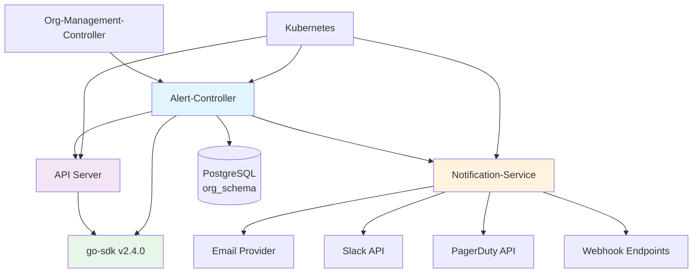
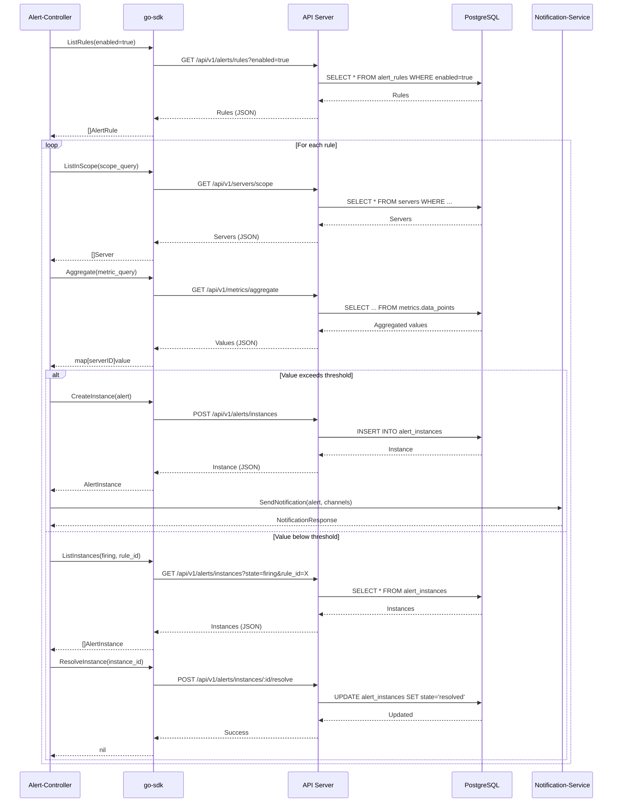
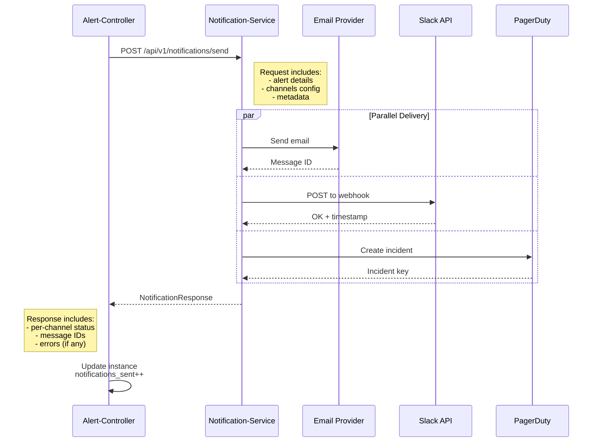
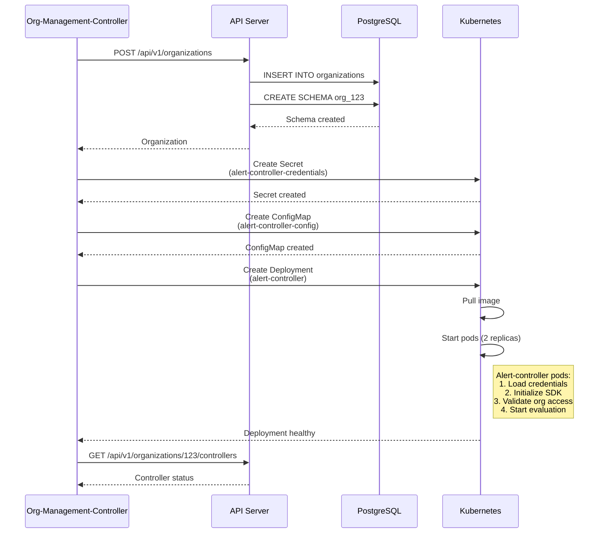

# Alert Controller - Integration Specification

**Document Version**: 1.0
**Last Updated**: 2025-10-23
**Status**: Draft
**Related Documents**:
- [alert-controller-p1-architecture.md](./alert-controller-p1-architecture.md) - Architecture & Current State Analysis
- [alert-controller-api-first-refactoring.md](./alert-controller-api-first-refactoring.md) - API-First Refactoring Strategy
- [alert-controller-implementation-plan.md](./alert-controller-implementation-plan.md) - Implementation Roadmap

---

## Executive Summary

This document specifies the integration contracts between the alert-controller and other Nexmonyx platform services. It defines API contracts, data flows, error handling patterns, and monitoring requirements to ensure reliable inter-service communication.

**Key Integration Points**:
1. **Notification-Service**: Multi-channel alert notification delivery
2. **Org-Management-Controller**: Organization provisioning and lifecycle management
3. **API Server**: Alert data access via RESTful API with SDK abstraction
4. **Database**: Per-organization PostgreSQL schema with data isolation
5. **Kubernetes**: Service discovery, health checks, and deployment orchestration

**Integration Architecture**:
- **Communication Pattern**: Synchronous HTTP/HTTPS with retry logic
- **Authentication**: API Key + Secret with JWT for user-initiated requests
- **Error Handling**: Exponential backoff with circuit breaker pattern
- **Monitoring**: Prometheus metrics with Grafana visualization

---

## Table of Contents

1. [Integration Architecture Overview](#integration-architecture-overview)
2. [Notification-Service Integration](#notification-service-integration)
3. [Org-Management-Controller Integration](#org-management-controller-integration)
4. [API Server Integration](#api-server-integration)
5. [Database Integration](#database-integration)
6. [Kubernetes Integration](#kubernetes-integration)
7. [Error Handling Patterns](#error-handling-patterns)
8. [Authentication & Authorization](#authentication-authorization)
9. [Health Checks & Monitoring](#health-checks-monitoring)
10. [Data Flow Diagrams](#data-flow-diagrams)

---

## Integration Architecture Overview

### Service Dependencies



**Dependency Matrix**:

| Service | Alert-Controller Depends On | Dependencies |
|---------|----------------------------|--------------|
| **API Server** | ✅ CRITICAL | Alert instances CRUD, metrics queries, server scope |
| **Notification-Service** | ✅ CRITICAL | Multi-channel notification delivery |
| **go-sdk** | ✅ CRITICAL | API abstraction layer for all data access |
| **PostgreSQL** | ✅ CRITICAL | Per-organization alert data persistence |
| **Org-Management-Controller** | ⚠️ MODERATE | Organization lifecycle events |
| **Kubernetes** | ✅ CRITICAL | Service discovery, health checks, scaling |

### Communication Patterns

**Synchronous (HTTP/HTTPS)**:
- Alert-Controller → API Server (via go-sdk)
- Alert-Controller → Notification-Service
- API Server → Database

**Event-Driven (Future)**:
- Org-Management-Controller → Alert-Controller (organization lifecycle events)
- API Server → Alert-Controller (alert rule changes)

### API-First Architecture Compliance

**MANDATORY**: Alert-controller MUST use API/SDK calls for ALL data access.

**Before (Non-Compliant)**:
```go
// ❌ Direct database access
db.Where("organization_id = ?", orgID).Find(&alerts)
```

**After (Compliant)**:
```go
// ✅ API-first via SDK
alerts, _, err := sdkClient.Alerts.ListInstances(ctx, &nexmonyx.ListOptions{
    Filters: map[string]interface{}{"organization_id": orgID},
})
```

---

## Notification-Service Integration

### Service Overview

**Purpose**: Deliver alert notifications via multiple channels (Email, Slack, PagerDuty, Webhook, Teams, SMS).

**Deployment**: Multi-tenant service (ONE instance handles ALL organizations)

**API Base URL**:
- Dev: `http://notification-service.nexmonyx-dev.svc.cluster.local:8080`
- Staging: `http://notification-service.nexmonyx-staging.svc.cluster.local:8080`
- Prod: `http://notification-service.nexmonyx-prod.svc.cluster.local:8080`

### API Contract

#### Send Notification

**Endpoint**: `POST /api/v1/notifications/send`

**Request Headers**:
```
Content-Type: application/json
X-Organization-ID: <organization-id>
X-Alert-Controller-ID: <controller-instance-id>
```

**Request Body**:
```json
{
  "notification_type": "alert",
  "priority": "high",
  "organization_id": 123,
  "alert_instance": {
    "id": 456,
    "rule_id": 789,
    "rule_name": "High CPU Usage",
    "server_id": 101,
    "server_name": "web-server-01",
    "state": "firing",
    "severity": "critical",
    "value": 92.5,
    "threshold": 80.0,
    "fired_at": "2025-10-23T10:30:00Z",
    "message": "CPU usage is at 92.5%, exceeding critical threshold of 80%"
  },
  "channels": [
    {
      "type": "email",
      "config": {
        "to": ["ops@example.com", "oncall@example.com"],
        "subject": "CRITICAL: High CPU on web-server-01",
        "template": "alert_critical"
      }
    },
    {
      "type": "slack",
      "config": {
        "webhook_url": "https://hooks.slack.com/services/...",
        "channel": "#alerts",
        "username": "Nexmonyx Alerts"
      }
    },
    {
      "type": "pagerduty",
      "config": {
        "routing_key": "R12345...",
        "severity": "critical",
        "dedup_key": "alert-456"
      }
    }
  ],
  "metadata": {
    "alert_url": "https://app.nexmonyx.com/alerts/456",
    "server_url": "https://app.nexmonyx.com/servers/101",
    "evaluation_timestamp": "2025-10-23T10:30:15Z"
  }
}
```

**Response (Success)**:
```json
{
  "status": "success",
  "notification_id": "notif_abc123",
  "results": [
    {
      "channel": "email",
      "status": "sent",
      "message_id": "msg_xyz789"
    },
    {
      "channel": "slack",
      "status": "sent",
      "message_id": "slack_ts_1234567890"
    },
    {
      "channel": "pagerduty",
      "status": "sent",
      "incident_key": "PQRS456"
    }
  ],
  "timestamp": "2025-10-23T10:30:16Z"
}
```

**Response (Partial Failure)**:
```json
{
  "status": "partial_success",
  "notification_id": "notif_abc124",
  "results": [
    {
      "channel": "email",
      "status": "sent",
      "message_id": "msg_xyz790"
    },
    {
      "channel": "slack",
      "status": "failed",
      "error": "Webhook URL returned 404"
    },
    {
      "channel": "pagerduty",
      "status": "sent",
      "incident_key": "PQRS457"
    }
  ],
  "timestamp": "2025-10-23T10:30:17Z"
}
```

**Error Responses**:

| Status Code | Error | Description |
|-------------|-------|-------------|
| 400 | invalid_request | Missing required fields or invalid format |
| 401 | unauthorized | Missing or invalid authentication |
| 403 | forbidden | Insufficient permissions for organization |
| 429 | rate_limit_exceeded | Too many notifications (per-org limits) |
| 500 | internal_error | Notification service error |
| 503 | service_unavailable | Service temporarily unavailable |

### Integration Code Example

**Location**: `/home/mmattox/go/src/github.com/nexmonyx/nexmonyx/pkg/alerts/controller/notifier.go`

```go
package controller

import (
    "bytes"
    "context"
    "encoding/json"
    "fmt"
    "net/http"
    "time"

    "github.com/nexmonyx/nexmonyx/pkg/logging"
    "github.com/nexmonyx/nexmonyx/pkg/models"
)

type NotificationService struct {
    baseURL    string
    httpClient *http.Client
    logger     *logging.Logger
}

type NotificationRequest struct {
    NotificationType string                 `json:"notification_type"`
    Priority         string                 `json:"priority"`
    OrganizationID   uint                   `json:"organization_id"`
    AlertInstance    *AlertInstancePayload  `json:"alert_instance"`
    Channels         []NotificationChannel  `json:"channels"`
    Metadata         map[string]interface{} `json:"metadata"`
}

type AlertInstancePayload struct {
    ID         uint      `json:"id"`
    RuleID     uint      `json:"rule_id"`
    RuleName   string    `json:"rule_name"`
    ServerID   uint      `json:"server_id"`
    ServerName string    `json:"server_name"`
    State      string    `json:"state"`
    Severity   string    `json:"severity"`
    Value      float64   `json:"value"`
    Threshold  float64   `json:"threshold"`
    FiredAt    time.Time `json:"fired_at"`
    Message    string    `json:"message"`
}

type NotificationChannel struct {
    Type   string                 `json:"type"`
    Config map[string]interface{} `json:"config"`
}

type NotificationResponse struct {
    Status         string                 `json:"status"`
    NotificationID string                 `json:"notification_id"`
    Results        []ChannelResult        `json:"results"`
    Timestamp      time.Time              `json:"timestamp"`
}

type ChannelResult struct {
    Channel   string `json:"channel"`
    Status    string `json:"status"`
    MessageID string `json:"message_id,omitempty"`
    Error     string `json:"error,omitempty"`
}

func NewNotificationService(baseURL string, logger *logging.Logger) *NotificationService {
    return &NotificationService{
        baseURL: baseURL,
        httpClient: &http.Client{
            Timeout: 30 * time.Second,
        },
        logger: logger,
    }
}

func (n *NotificationService) SendAlertNotification(ctx context.Context, instance *models.AlertInstance, rule *models.AlertRule, server *models.Server, channels []NotificationChannel) (*NotificationResponse, error) {
    if n.logger.ShouldTrace("SendAlertNotification") {
        n.logger.Trace(ctx, "SendAlertNotification", "Sending notification for alert %d", instance.ID)
    }

    // Build notification request
    req := &NotificationRequest{
        NotificationType: "alert",
        Priority:         getPriorityFromSeverity(instance.Severity),
        OrganizationID:   instance.OrganizationID,
        AlertInstance: &AlertInstancePayload{
            ID:         instance.ID,
            RuleID:     rule.ID,
            RuleName:   rule.Name,
            ServerID:   server.ID,
            ServerName: server.Name,
            State:      instance.State,
            Severity:   instance.Severity,
            Value:      instance.Value,
            Threshold:  getThresholdForSeverity(rule, instance.Severity),
            FiredAt:    instance.FiredAt,
            Message:    formatAlertMessage(instance, rule, server),
        },
        Channels: channels,
        Metadata: map[string]interface{}{
            "alert_url":             fmt.Sprintf("https://app.nexmonyx.com/alerts/%d", instance.ID),
            "server_url":            fmt.Sprintf("https://app.nexmonyx.com/servers/%d", server.ID),
            "evaluation_timestamp":  time.Now().UTC().Format(time.RFC3339),
        },
    }

    // Marshal request
    body, err := json.Marshal(req)
    if err != nil {
        return nil, fmt.Errorf("failed to marshal notification request: %w", err)
    }

    // Create HTTP request
    url := fmt.Sprintf("%s/api/v1/notifications/send", n.baseURL)
    httpReq, err := http.NewRequestWithContext(ctx, "POST", url, bytes.NewReader(body))
    if err != nil {
        return nil, fmt.Errorf("failed to create HTTP request: %w", err)
    }

    httpReq.Header.Set("Content-Type", "application/json")
    httpReq.Header.Set("X-Organization-ID", fmt.Sprintf("%d", instance.OrganizationID))
    httpReq.Header.Set("X-Alert-Controller-ID", "alert-controller-instance-id")

    // Send request with retry logic
    resp, err := n.sendWithRetry(ctx, httpReq, 3)
    if err != nil {
        return nil, fmt.Errorf("failed to send notification: %w", err)
    }
    defer resp.Body.Close()

    // Parse response
    var notifResp NotificationResponse
    if err := json.NewDecoder(resp.Body).Decode(&notifResp); err != nil {
        return nil, fmt.Errorf("failed to decode response: %w", err)
    }

    // Log results
    for _, result := range notifResp.Results {
        if result.Status == "sent" {
            n.logger.Debug(ctx, "SendAlertNotification", "Notification sent via %s: %s", result.Channel, result.MessageID)
        } else {
            n.logger.Warn(ctx, "SendAlertNotification", "Failed to send via %s: %s", result.Channel, result.Error)
        }
    }

    if n.logger.ShouldTrace("SendAlertNotification") {
        n.logger.Trace(ctx, "SendAlertNotification", "Notification request completed: %s", notifResp.Status)
    }

    return &notifResp, nil
}

func (n *NotificationService) sendWithRetry(ctx context.Context, req *http.Request, maxRetries int) (*http.Response, error) {
    var lastErr error

    for attempt := 0; attempt <= maxRetries; attempt++ {
        if attempt > 0 {
            // Exponential backoff
            backoff := time.Duration(attempt*attempt) * time.Second
            n.logger.Debug(ctx, "sendWithRetry", "Retry attempt %d after %v", attempt, backoff)
            time.Sleep(backoff)
        }

        resp, err := n.httpClient.Do(req)
        if err != nil {
            lastErr = err
            continue
        }

        // Success (2xx status codes)
        if resp.StatusCode >= 200 && resp.StatusCode < 300 {
            return resp, nil
        }

        // Don't retry client errors (4xx)
        if resp.StatusCode >= 400 && resp.StatusCode < 500 {
            return resp, fmt.Errorf("client error: %d", resp.StatusCode)
        }

        // Retry server errors (5xx)
        resp.Body.Close()
        lastErr = fmt.Errorf("server error: %d", resp.StatusCode)
    }

    return nil, fmt.Errorf("max retries exceeded: %w", lastErr)
}

func getPriorityFromSeverity(severity string) string {
    switch severity {
    case "critical":
        return "high"
    case "warning":
        return "medium"
    case "info":
        return "low"
    default:
        return "medium"
    }
}

func getThresholdForSeverity(rule *models.AlertRule, severity string) float64 {
    switch severity {
    case "critical":
        if rule.Conditions.Critical != nil {
            return rule.Conditions.Critical.Value
        }
    case "warning":
        if rule.Conditions.Warning != nil {
            return rule.Conditions.Warning.Value
        }
    case "info":
        if rule.Conditions.Info != nil {
            return rule.Conditions.Info.Value
        }
    }
    return 0
}

func formatAlertMessage(instance *models.AlertInstance, rule *models.AlertRule, server *models.Server) string {
    return fmt.Sprintf(
        "%s is at %.2f%%, exceeding %s threshold of %.2f%% on server %s",
        rule.MetricName,
        instance.Value,
        instance.Severity,
        getThresholdForSeverity(rule, instance.Severity),
        server.Name,
    )
}
```

### Rate Limiting

**Per-Organization Limits**:
- Email: 100 notifications/hour
- Slack: 1000 notifications/hour
- PagerDuty: 100 notifications/hour
- Webhook: 500 notifications/hour

**Global Limits**:
- 10,000 notifications/minute across all organizations

**Rate Limit Headers** (in response):
```
X-RateLimit-Limit: 100
X-RateLimit-Remaining: 75
X-RateLimit-Reset: 1698062400
```

### Error Handling

**Alert-Controller Responsibilities**:
1. Retry failed notifications (exponential backoff, max 3 attempts)
2. Log notification failures for debugging
3. Update alert instance with notification status
4. Track notification delivery metrics

**Notification-Service Responsibilities**:
1. Validate request format and authentication
2. Apply rate limiting per organization
3. Deliver to all specified channels (best-effort)
4. Return detailed per-channel results
5. Log delivery metrics for monitoring

**Failure Scenarios**:

| Scenario | Alert-Controller Action | Notification-Service Action |
|----------|------------------------|----------------------------|
| Invalid request (400) | Log error, don't retry | Return validation errors |
| Auth failure (401) | Alert ops team, retry | Reject request |
| Rate limit (429) | Backoff, retry after reset | Return retry-after header |
| Channel unavailable (503) | Retry with backoff | Try other channels |
| Partial failure | Continue, log failures | Return per-channel status |

### Monitoring

**Metrics to Track**:

**Alert-Controller Side**:
```
notification_send_total{status="success|failure", channel="email|slack|pagerduty|webhook"}
notification_send_duration_seconds{channel}
notification_retry_total{attempt}
notification_errors_total{error_type}
```

**Notification-Service Side**:
```
notifications_received_total{organization_id, channel}
notifications_sent_total{organization_id, channel, status}
notification_delivery_duration_seconds{channel}
rate_limit_exceeded_total{organization_id, channel}
```

---

## Org-Management-Controller Integration

### Service Overview

**Purpose**: Orchestrate organization lifecycle, provision per-organization resources, manage controllers.

**Deployment**: Single-tenant (ONE instance per organization)

**Communication Pattern**: Event-driven (future) + API-based (current)

### Integration Requirements

**Organization Provisioning**:
1. Org-Management-Controller creates organization
2. Creates per-organization database schema (`org_{id}`)
3. Provisions alert-controller instance for organization
4. Configures alert-controller with API credentials
5. Deploys alert-controller to Kubernetes cluster

**Alert-Controller Registration**:
1. Alert-controller starts up
2. Connects to API server using provided credentials
3. Validates organization context
4. Begins alert evaluation cycle

### API Contracts

#### Get Organization Configuration

**Endpoint**: `GET /api/v1/organizations/{id}/config`

**Response**:
```json
{
  "organization_id": 123,
  "name": "Example Corp",
  "database_schema": "org_123",
  "alert_controller": {
    "enabled": true,
    "api_key": "alert_ctrl_key_123",
    "api_secret": "alert_ctrl_secret_xyz",
    "evaluation_interval_seconds": 60
  },
  "notification_channels": [
    {
      "id": 1,
      "type": "email",
      "enabled": true,
      "config": {
        "default_recipients": ["ops@example.com"]
      }
    }
  ]
}
```

### Event-Driven Integration (Future Enhancement)

**Planned Events**:

1. **OrganizationCreated**: Provision alert-controller
2. **OrganizationUpdated**: Update controller configuration
3. **OrganizationDeleted**: Deprovision controller
4. **NotificationChannelAdded**: Update notification routing
5. **NotificationChannelRemoved**: Stop using channel

**Event Schema**:
```json
{
  "event_type": "organization.created",
  "event_id": "evt_abc123",
  "timestamp": "2025-10-23T10:30:00Z",
  "organization_id": 123,
  "data": {
    "name": "Example Corp",
    "database_schema": "org_123",
    "alert_controller_config": {
      "api_key": "...",
      "api_secret": "..."
    }
  }
}
```

---

## API Server Integration

### Service Overview

**Purpose**: Provide centralized API for all alert data access, metrics queries, and server scope resolution.

**Deployment**: Multi-tenant (ONE instance handles ALL organizations)

**Base URL**:
- Dev: `https://api-dev.nexmonyx.com`
- Staging: `https://api-staging.nexmonyx.com`
- Prod: `https://api.nexmonyx.com`

### API Endpoints Used by Alert-Controller

**Via go-sdk v2.4.0**:

#### Alert Instances

| SDK Method | HTTP Endpoint | Purpose |
|------------|---------------|---------|
| `ListInstances()` | `GET /api/v1/alerts/instances` | List/filter alert instances |
| `GetInstance()` | `GET /api/v1/alerts/instances/:id` | Get specific instance |
| `CreateInstance()` | `POST /api/v1/alerts/instances` | Create new alert instance |
| `UpdateInstance()` | `PATCH /api/v1/alerts/instances/:id` | Update instance state/severity |
| `ResolveInstance()` | `POST /api/v1/alerts/instances/:id/resolve` | Mark instance as resolved |

#### Alert Rules

| SDK Method | HTTP Endpoint | Purpose |
|------------|---------------|---------|
| `List()` | `GET /api/v1/alerts/rules` | Get all enabled rules for evaluation |
| `Get()` | `GET /api/v1/alerts/rules/:id` | Get specific rule details |

#### Server Scope

| SDK Method | HTTP Endpoint | Purpose |
|------------|---------------|---------|
| `ListInScope()` | `GET /api/v1/servers/scope` | Get servers matching scope criteria |

#### Metrics

| SDK Method | HTTP Endpoint | Purpose |
|------------|---------------|---------|
| `Query()` | `GET /api/v1/metrics/query` | Get raw metric data points |
| `Aggregate()` | `GET /api/v1/metrics/aggregate` | Get aggregated metric values |

### SDK Client Configuration

**Location**: `/home/mmattox/go/src/github.com/nexmonyx/nexmonyx/cmd/alert-controller/main.go`

```go
import "github.com/nexmonyx/go-sdk"

// Initialize SDK client
sdkClient, err := nexmonyx.NewClient(&nexmonyx.Config{
    BaseURL: os.Getenv("NEXMONYX_API_URL"),
    Auth: nexmonyx.AuthConfig{
        APIKey:    os.Getenv("NEXMONYX_API_KEY"),
        APISecret: os.Getenv("NEXMONYX_API_SECRET"),
    },
    Timeout: 30 * time.Second,
    Retry: nexmonyx.RetryConfig{
        MaxRetries:   3,
        RetryWaitMin: 1 * time.Second,
        RetryWaitMax: 5 * time.Second,
        RetryPolicy: func(resp *http.Response, err error) bool {
            // Retry on server errors (5xx) and network errors
            if err != nil {
                return true
            }
            return resp.StatusCode >= 500
        },
    },
    Logger: logger,
})
```

### Request/Response Examples

#### List Alert Instances (for cleanup)

**Request**:
```go
instances, meta, err := sdkClient.Alerts.ListInstances(ctx, &nexmonyx.ListOptions{
    Filters: map[string]interface{}{
        "state": "resolved",
        "resolved_before": time.Now().Add(-24 * time.Hour).Format(time.RFC3339),
    },
    Page:     1,
    PageSize: 100,
})
```

**HTTP Request**:
```
GET /api/v1/alerts/instances?state=resolved&resolved_before=2025-10-22T10:30:00Z&page=1&page_size=100
Authorization: Bearer <jwt-token>
X-Organization-ID: 123
```

**Response**:
```json
{
  "status": "success",
  "data": [
    {
      "id": 456,
      "rule_id": 789,
      "server_id": 101,
      "organization_id": 123,
      "state": "resolved",
      "severity": "warning",
      "value": 75.5,
      "fired_at": "2025-10-21T08:00:00Z",
      "resolved_at": "2025-10-21T09:30:00Z",
      "resolved_by": "auto-resolved"
    }
  ],
  "meta": {
    "total": 150,
    "page": 1,
    "page_size": 100,
    "total_pages": 2
  }
}
```

#### Create Alert Instance

**Request**:
```go
instance := &nexmonyx.AlertInstance{
    RuleID:   789,
    ServerID: 101,
    State:    "firing",
    Severity: "critical",
    Value:    92.5,
    FiredAt:  time.Now(),
}

created, err := sdkClient.Alerts.CreateInstance(ctx, instance)
```

**HTTP Request**:
```
POST /api/v1/alerts/instances
Authorization: Bearer <jwt-token>
X-Organization-ID: 123
Content-Type: application/json

{
  "rule_id": 789,
  "server_id": 101,
  "state": "firing",
  "severity": "critical",
  "value": 92.5,
  "fired_at": "2025-10-23T10:30:00Z"
}
```

**Response**:
```json
{
  "status": "success",
  "data": {
    "id": 457,
    "rule_id": 789,
    "server_id": 101,
    "organization_id": 123,
    "state": "firing",
    "severity": "critical",
    "value": 92.5,
    "fired_at": "2025-10-23T10:30:00Z",
    "created_at": "2025-10-23T10:30:01Z"
  },
  "message": "Alert instance created successfully"
}
```

#### Aggregate Metrics

**Request**:
```go
values, err := sdkClient.Metrics.Aggregate(ctx, &nexmonyx.AggregateQuery{
    ServerIDs:      []uint{101, 102, 103},
    MetricName:     "cpu_usage",
    Aggregation:    "avg",
    TimeWindowMins: 15,
})
```

**HTTP Request**:
```
GET /api/v1/metrics/aggregate?server_ids=101,102,103&metric_name=cpu_usage&aggregation=avg&time_window_mins=15
Authorization: Bearer <jwt-token>
X-Organization-ID: 123
```

**Response**:
```json
{
  "status": "success",
  "data": {
    "101": 85.5,
    "102": 78.2,
    "103": 92.8
  },
  "metadata": {
    "aggregation": "avg",
    "time_window_mins": 15,
    "timestamp": "2025-10-23T10:30:00Z"
  }
}
```

### Performance Requirements

**API Server SLAs**:
- Response time (p95): < 500ms for simple queries
- Response time (p95): < 2s for complex aggregations
- Availability: 99.9% uptime
- Error rate: < 0.1% for valid requests

**Alert-Controller Expectations**:
- Total alert evaluation time: < 2s per rule (including API calls)
- API call retries: Max 3 attempts with exponential backoff
- Timeout: 30s per API call
- Concurrent requests: Max 10 per controller instance

### Error Handling

**SDK Error Types**:

```go
import "github.com/nexmonyx/go-sdk/pkg/errors"

// Network errors
if errors.Is(err, nexmonyx.ErrNetworkError) {
    // Retry with backoff
}

// Authentication errors
if errors.Is(err, nexmonyx.ErrUnauthorized) {
    // Log and alert - credentials may be invalid
}

// Not found errors
if errors.Is(err, nexmonyx.ErrNotFound) {
    // Resource doesn't exist - may be expected
}

// Rate limit errors
if errors.Is(err, nexmonyx.ErrRateLimited) {
    // Back off and retry after specified duration
}

// Server errors
if errors.Is(err, nexmonyx.ErrServerError) {
    // Retry with backoff, alert if persistent
}
```

**Retry Logic**:

```go
func (e *Evaluator) createInstanceWithRetry(ctx context.Context, instance *nexmonyx.AlertInstance) (*nexmonyx.AlertInstance, error) {
    var lastErr error

    for attempt := 0; attempt <= 3; attempt++ {
        if attempt > 0 {
            backoff := time.Duration(attempt*attempt) * time.Second
            time.Sleep(backoff)
        }

        created, err := e.config.SDKClient.Alerts.CreateInstance(ctx, instance)
        if err == nil {
            return created, nil
        }

        // Don't retry client errors
        if errors.Is(err, nexmonyx.ErrBadRequest) ||
           errors.Is(err, nexmonyx.ErrUnauthorized) ||
           errors.Is(err, nexmonyx.ErrForbidden) {
            return nil, err
        }

        lastErr = err
    }

    return nil, fmt.Errorf("max retries exceeded: %w", lastErr)
}
```

---

## Database Integration

### Database Architecture

**Pattern**: Single-tenant per-organization PostgreSQL schemas

**Schema Naming**: `org_{organization_id}`

**Connection Management**: Via API Server (no direct database access from alert-controller)

### Database Schema

**Tables Used** (via API):

#### alert_instances

```sql
CREATE TABLE alert_instances (
    id BIGSERIAL PRIMARY KEY,
    organization_id BIGINT NOT NULL,
    rule_id BIGINT NOT NULL,
    server_id BIGINT NOT NULL,
    state VARCHAR(50) NOT NULL,  -- pending, firing, resolved, silenced
    severity VARCHAR(50) NOT NULL,  -- info, warning, critical
    value DOUBLE PRECISION NOT NULL,
    fired_at TIMESTAMP NOT NULL,
    acknowledged_at TIMESTAMP,
    acknowledged_by VARCHAR(255),
    resolved_at TIMESTAMP,
    resolved_by VARCHAR(255),
    silenced_until TIMESTAMP,
    notifications_sent INTEGER DEFAULT 0,
    last_notification_at TIMESTAMP,
    created_at TIMESTAMP DEFAULT NOW(),
    updated_at TIMESTAMP DEFAULT NOW(),
    deleted_at TIMESTAMP,

    CONSTRAINT fk_rule FOREIGN KEY (rule_id) REFERENCES alert_rules(id),
    CONSTRAINT fk_server FOREIGN KEY (server_id) REFERENCES servers(id),
    INDEX idx_state (state),
    INDEX idx_severity (severity),
    INDEX idx_fired_at (fired_at DESC),
    INDEX idx_rule_server (rule_id, server_id, state)
);
```

#### alert_rules

```sql
CREATE TABLE alert_rules (
    id BIGSERIAL PRIMARY KEY,
    organization_id BIGINT NOT NULL,
    name VARCHAR(255) NOT NULL,
    description TEXT,
    scope_type VARCHAR(50) NOT NULL,  -- organization, group, tag, server
    scope_ids BIGINT[],  -- Array of IDs based on scope_type
    tag_filters TEXT[],  -- Array of tag names (for tag scope)
    metric_name VARCHAR(100) NOT NULL,
    aggregation VARCHAR(50) NOT NULL,  -- avg, max, min, sum, count
    conditions JSONB NOT NULL,  -- Multi-severity thresholds
    notification_channels JSONB,  -- Channel configuration
    enabled BOOLEAN DEFAULT true,
    evaluation_interval_seconds INTEGER DEFAULT 60,
    created_at TIMESTAMP DEFAULT NOW(),
    updated_at TIMESTAMP DEFAULT NOW(),
    deleted_at TIMESTAMP,

    INDEX idx_enabled (enabled, deleted_at),
    INDEX idx_org_enabled (organization_id, enabled)
);
```

### Data Access Patterns

**Alert-Controller NEVER accesses database directly. All access via API/SDK.**

**Read Operations** (via SDK):
- List alert rules for evaluation
- List alert instances (for cleanup, status checks)
- Get specific alert instance
- Query metrics (aggregated and raw)
- Get servers in scope

**Write Operations** (via SDK):
- Create alert instance
- Update alert instance (state, severity, value)
- Resolve alert instance
- Delete old alert instances (cleanup)

### Data Consistency

**Eventual Consistency Acceptable**:
- Alert instance creation → notification delivery (seconds)
- Alert resolution → UI update (seconds)

**Strong Consistency Required**:
- Alert rule changes → evaluation logic (immediate via cache invalidation)
- Server scope changes → alert targeting (immediate)

**Transaction Boundaries**:
- API Server ensures transactional integrity
- Alert-Controller operates on best-effort basis
- Idempotent operations prevent duplicate alerts

---

## Kubernetes Integration

### Service Discovery

**Alert-Controller Service**:
```yaml
apiVersion: v1
kind: Service
metadata:
  name: alert-controller
  namespace: nexmonyx-prod
  labels:
    app: alert-controller
    organization_id: "123"
spec:
  selector:
    app: alert-controller
    organization_id: "123"
  ports:
  - name: http
    port: 8080
    targetPort: 8080
  - name: metrics
    port: 9090
    targetPort: 9090
```

**Service Discovery for Notification-Service**:
```go
// Internal Kubernetes DNS
notificationServiceURL := "http://notification-service.nexmonyx-prod.svc.cluster.local:8080"

// External URL (for debugging)
notificationServiceURL := "https://notifications.nexmonyx.com"
```

### Health Checks

**Liveness Probe**:
```yaml
livenessProbe:
  httpGet:
    path: /health
    port: 8080
  initialDelaySeconds: 30
  periodSeconds: 10
  timeoutSeconds: 5
  failureThreshold: 3
```

**Readiness Probe**:
```yaml
readinessProbe:
  httpGet:
    path: /ready
    port: 8080
  initialDelaySeconds: 10
  periodSeconds: 5
  timeoutSeconds: 3
  failureThreshold: 2
```

**Health Endpoint Implementation**:

```go
// GET /health - Liveness check
func (h *HealthHandler) Liveness(c *fiber.Ctx) error {
    // Basic check: is the process running?
    return c.JSON(fiber.Map{
        "status": "healthy",
        "timestamp": time.Now().UTC(),
    })
}

// GET /ready - Readiness check
func (h *HealthHandler) Readiness(c *fiber.Ctx) error {
    checks := map[string]bool{
        "sdk_client":  h.checkSDKClient(),
        "api_server":  h.checkAPIServer(),
        "evaluation":  h.checkEvaluationRunning(),
    }

    allHealthy := true
    for _, healthy := range checks {
        if !healthy {
            allHealthy = false
            break
        }
    }

    status := "ready"
    httpStatus := fiber.StatusOK
    if !allHealthy {
        status = "not_ready"
        httpStatus = fiber.StatusServiceUnavailable
    }

    return c.Status(httpStatus).JSON(fiber.Map{
        "status": status,
        "checks": checks,
        "timestamp": time.Now().UTC(),
    })
}

func (h *HealthHandler) checkSDKClient() bool {
    // Quick check if SDK client is initialized
    return h.sdkClient != nil
}

func (h *HealthHandler) checkAPIServer() bool {
    // Ping API server with timeout
    ctx, cancel := context.WithTimeout(context.Background(), 2*time.Second)
    defer cancel()

    _, err := h.sdkClient.Health.Ping(ctx)
    return err == nil
}

func (h *HealthHandler) checkEvaluationRunning() bool {
    // Check if evaluation cycle has run in last 2 minutes
    lastEval := h.evaluator.GetLastEvaluationTime()
    return time.Since(lastEval) < 2*time.Minute
}
```

### Resource Limits

**Production Configuration**:
```yaml
resources:
  limits:
    cpu: "1000m"      # 1 CPU core max
    memory: "512Mi"   # 512 MB max
  requests:
    cpu: "200m"       # 0.2 CPU cores guaranteed
    memory: "256Mi"   # 256 MB guaranteed
```

**Autoscaling** (future enhancement):
```yaml
apiVersion: autoscaling/v2
kind: HorizontalPodAutoscaler
metadata:
  name: alert-controller-hpa
spec:
  scaleTargetRef:
    apiVersion: apps/v1
    kind: Deployment
    name: alert-controller
  minReplicas: 2
  maxReplicas: 5
  metrics:
  - type: Resource
    resource:
      name: cpu
      target:
        type: Utilization
        averageUtilization: 70
  - type: Resource
    resource:
      name: memory
      target:
        type: Utilization
        averageUtilization: 80
```

### ConfigMaps and Secrets

**ConfigMap** (non-sensitive config):
```yaml
apiVersion: v1
kind: ConfigMap
metadata:
  name: alert-controller-config
  namespace: nexmonyx-prod
data:
  ORGANIZATION_ID: "123"
  EVALUATION_INTERVAL: "60"
  LOG_LEVEL: "info"
  NEXMONYX_API_URL: "https://api.nexmonyx.com"
  NOTIFICATION_SERVICE_URL: "http://notification-service.nexmonyx-prod.svc.cluster.local:8080"
```

**Secret** (sensitive credentials):
```yaml
apiVersion: v1
kind: Secret
metadata:
  name: alert-controller-credentials
  namespace: nexmonyx-prod
type: Opaque
stringData:
  api-key: "alert_ctrl_key_org_123"
  api-secret: "alert_ctrl_secret_xyz_abc_def"
```

**Deployment Usage**:
```yaml
env:
- name: NEXMONYX_API_KEY
  valueFrom:
    secretKeyRef:
      name: alert-controller-credentials
      key: api-key
- name: NEXMONYX_API_SECRET
  valueFrom:
    secretKeyRef:
      name: alert-controller-credentials
      key: api-secret
- name: ORGANIZATION_ID
  valueFrom:
    configMapKeyRef:
      name: alert-controller-config
      key: ORGANIZATION_ID
```

---

## Error Handling Patterns

### Retry Strategies

#### Exponential Backoff

**Implementation**:
```go
func exponentialBackoff(attempt int, min, max time.Duration) time.Duration {
    backoff := min * time.Duration(1<<uint(attempt))
    if backoff > max {
        backoff = max
    }
    return backoff
}

// Usage
for attempt := 0; attempt <= maxRetries; attempt++ {
    if attempt > 0 {
        backoff := exponentialBackoff(attempt, 1*time.Second, 30*time.Second)
        time.Sleep(backoff)
    }

    result, err := operation()
    if err == nil {
        return result, nil
    }

    if !isRetriable(err) {
        return nil, err
    }
}
```

**Configuration**:
- Initial delay: 1 second
- Max delay: 30 seconds
- Max retries: 3
- Jitter: ±10% random variation

#### Circuit Breaker

**States**:
- **Closed**: Normal operation, requests pass through
- **Open**: Too many failures, reject requests immediately
- **Half-Open**: Testing if service recovered

**Implementation** (using sony/gobreaker):
```go
import "github.com/sony/gobreaker"

// Initialize circuit breaker
cb := gobreaker.NewCircuitBreaker(gobreaker.Settings{
    Name:        "notification-service",
    MaxRequests: 3,  // Half-open → closed after 3 successes
    Interval:    60 * time.Second,  // Rolling window
    Timeout:     30 * time.Second,  // Open → half-open after timeout
    ReadyToTrip: func(counts gobreaker.Counts) bool {
        failureRatio := float64(counts.TotalFailures) / float64(counts.Requests)
        return counts.Requests >= 10 && failureRatio >= 0.5
    },
    OnStateChange: func(name string, from gobreaker.State, to gobreaker.State) {
        logger.Warn(ctx, "CircuitBreaker", "State changed: %s → %s", from, to)
    },
})

// Use circuit breaker
result, err := cb.Execute(func() (interface{}, error) {
    return sendNotification(ctx, notification)
})
```

### Error Classification

**Retriable Errors** (retry with backoff):
- Network timeouts
- Connection refused
- HTTP 5xx server errors
- HTTP 429 rate limit (with retry-after)
- Temporary DNS failures

**Non-Retriable Errors** (fail immediately):
- HTTP 4xx client errors (except 429)
- Invalid credentials (401)
- Forbidden (403)
- Bad request (400)
- Not found (404)
- Validation errors

**Fatal Errors** (alert and shutdown):
- Invalid configuration
- Missing required environment variables
- SDK initialization failure
- Continuous API failures (> 5 minutes)

### Error Logging

**Log Levels**:

```go
// ERROR: Unexpected failures requiring investigation
logger.Error(ctx, "CreateInstance", "Failed to create alert instance: %v", err)

// WARN: Expected errors or degraded functionality
logger.Warn(ctx, "SendNotification", "Notification channel unavailable: %s", channel)

// INFO: Normal operational events
logger.Info(ctx, "EvaluationCycle", "Evaluated %d rules in %v", count, duration)

// DEBUG: Detailed troubleshooting information
logger.Debug(ctx, "GetMetrics", "Retrieved %d data points for server %d", len(points), serverID)

// TRACE: Extremely verbose debugging (disabled in production)
if logger.ShouldTrace("HandleRequest") {
    logger.Trace(ctx, "HandleRequest", "Request details: %+v", req)
}
```

**Error Context**:

```go
// Include relevant context in errors
return fmt.Errorf(
    "failed to create alert instance for rule %d, server %d: %w",
    ruleID, serverID, err,
)

// Log with structured fields
logger.Error(ctx, "CreateInstance",
    "Failed to create alert instance: %v [rule_id=%d, server_id=%d, severity=%s]",
    err, ruleID, serverID, severity,
)
```

---

## Authentication & Authorization

### API Key Authentication

**Credential Types**:
1. **Alert-Controller API Key**: Service-to-service authentication
2. **User JWT Token**: User-initiated API requests (via web UI/CLI)

**Environment Variables**:
```bash
NEXMONYX_API_KEY=alert_ctrl_key_org_123
NEXMONYX_API_SECRET=alert_ctrl_secret_xyz_abc_def
```

**SDK Configuration**:
```go
sdkClient, err := nexmonyx.NewClient(&nexmonyx.Config{
    BaseURL: "https://api.nexmonyx.com",
    Auth: nexmonyx.AuthConfig{
        APIKey:    os.Getenv("NEXMONYX_API_KEY"),
        APISecret: os.Getenv("NEXMONYX_API_SECRET"),
    },
})
```

**HTTP Headers**:
```
Authorization: Bearer <base64(api_key:api_secret)>
X-Organization-ID: 123
X-Service-Name: alert-controller
```

### Organization Scoping

**Automatic Scoping**:
- All API requests include `X-Organization-ID` header
- API server validates organization access
- Database queries automatically filtered by organization
- No cross-organization data leakage possible

**Enforcement**:
```go
// API Server middleware
func OrgScopeMiddleware(c *fiber.Ctx) error {
    orgID := c.Get("X-Organization-ID")
    if orgID == "" {
        return nexerrors.BadRequest(c, "Missing organization ID", "X-Organization-ID header required")
    }

    // Validate service has access to this organization
    if !validateServiceOrgAccess(c, orgID) {
        return nexerrors.Forbidden(c, "Access denied", "Service not authorized for this organization")
    }

    // Store in context for handlers
    c.Locals("organization_id", orgID)
    return c.Next()
}
```

### Permission Model

**Alert-Controller Permissions**:
- ✅ Read: Alert rules (enabled only)
- ✅ Read/Write: Alert instances
- ✅ Read: Server information (via scope queries)
- ✅ Read: Metrics (aggregated and raw)
- ❌ Write: Alert rules (read-only access)
- ❌ Write: Server configuration
- ❌ Admin: Organization settings

**API Key Scopes**:
```json
{
  "api_key": "alert_ctrl_key_org_123",
  "scopes": [
    "alerts:read",
    "alerts:write",
    "alert_instances:read",
    "alert_instances:write",
    "servers:read",
    "metrics:read"
  ],
  "organization_id": 123
}
```

---

## Health Checks & Monitoring

### Prometheus Metrics

**Exported Metrics**:

```go
// Alert evaluation metrics
alert_evaluation_total{status="success|failure"}
alert_evaluation_duration_seconds{quantile="0.5|0.95|0.99"}
alert_evaluation_rules_total
alert_evaluation_errors_total{error_type}

// Alert instance metrics
alert_instances_created_total
alert_instances_resolved_total
alert_instances_active{severity="info|warning|critical"}

// API/SDK metrics
sdk_requests_total{endpoint, method, status}
sdk_request_duration_seconds{endpoint, quantile}
sdk_errors_total{endpoint, error_type}
sdk_retries_total{endpoint, attempt}

// Notification metrics
notifications_sent_total{channel, status}
notifications_failed_total{channel, error_type}
notification_duration_seconds{channel, quantile}

// System metrics
process_cpu_usage_percent
process_memory_usage_bytes
go_goroutines
go_gc_duration_seconds
```

**Metrics Endpoint**:
```go
import "github.com/prometheus/client_golang/prometheus/promhttp"

// Expose metrics on :9090/metrics
app.Get("/metrics", adaptor.HTTPHandler(promhttp.Handler()))
```

### Grafana Dashboards

**Dashboard 1: Alert-Controller Overview**
- Active alerts by severity (gauge)
- Alert evaluation rate (graph)
- Alert evaluation duration (heatmap)
- Error rate (graph)
- API call success rate (gauge)

**Dashboard 2: Notification Delivery**
- Notifications sent by channel (graph)
- Notification success rate by channel (gauge)
- Notification latency (heatmap)
- Failed notifications (table)

**Dashboard 3: System Health**
- CPU usage (graph)
- Memory usage (graph)
- Goroutines (graph)
- API latency percentiles (graph)

### Alerting Rules

**Prometheus Alerts**:

```yaml
groups:
- name: alert-controller
  interval: 30s
  rules:
  - alert: AlertControllerDown
    expr: up{job="alert-controller"} == 0
    for: 2m
    annotations:
      summary: "Alert-controller instance {{ $labels.instance }} is down"
      severity: critical

  - alert: AlertEvaluationFailureRate
    expr: rate(alert_evaluation_errors_total[5m]) > 0.05
    for: 5m
    annotations:
      summary: "Alert evaluation failure rate > 5%"
      severity: warning

  - alert: AlertEvaluationSlow
    expr: histogram_quantile(0.95, rate(alert_evaluation_duration_seconds_bucket[5m])) > 3
    for: 10m
    annotations:
      summary: "Alert evaluation p95 latency > 3s"
      severity: warning

  - alert: SDKErrorRateHigh
    expr: rate(sdk_errors_total[5m]) > 0.01
    for: 5m
    annotations:
      summary: "SDK error rate > 1%"
      severity: critical

  - alert: NotificationFailureRate
    expr: rate(notifications_failed_total[5m]) > 0.1
    for: 10m
    annotations:
      summary: "Notification failure rate > 10%"
      severity: warning
```

### Logging Standards

**Structured Logging** (using nexmonyx logging package):

```go
logger.Info(ctx, "EvaluationCycle",
    "Evaluated %d rules in %v [success=%d, failures=%d]",
    totalRules, duration, successCount, failureCount,
)

logger.Error(ctx, "CreateInstance",
    "Failed to create alert instance: %v [rule_id=%d, server_id=%d, attempt=%d]",
    err, ruleID, serverID, attempt,
)

logger.Warn(ctx, "SendNotification",
    "Notification channel unavailable: %s [instance_id=%d, retry_after=%v]",
    channel, instanceID, retryAfter,
)
```

**Log Aggregation**:
- Centralized logging via Kubernetes log collector
- Logs forwarded to Elasticsearch/Loki
- Kibana/Grafana for log search and visualization

---

## Data Flow Diagrams

### Alert Evaluation Flow



### Notification Delivery Flow



### Organization Provisioning Flow



---

## Appendix

### Integration Checklist

**Before Deploying Alert-Controller**:

- [ ] API Server endpoints deployed and tested
- [ ] go-sdk v2.4.0 released and available
- [ ] Notification-Service running and accessible
- [ ] Per-organization database schema created
- [ ] API credentials generated and stored in Kubernetes secret
- [ ] ConfigMap created with organization ID and settings
- [ ] Health check endpoints implemented
- [ ] Prometheus metrics exposed
- [ ] Grafana dashboards created
- [ ] Alert rules configured in Prometheus
- [ ] Logging configured and tested
- [ ] Integration tests passing

### Testing Integration Points

**API Server Integration Tests**:
```bash
cd /home/mmattox/go/src/github.com/nexmonyx/nexmonyx
go test -v ./tests/integration/api_server_integration_test.go
```

**Notification-Service Integration Tests**:
```bash
go test -v ./tests/integration/notification_service_integration_test.go
```

**End-to-End Tests**:
```bash
go test -v ./tests/integration/alert_controller_e2e_test.go
```

### Reference Documents

1. [alert-controller-p1-architecture.md](./alert-controller-p1-architecture.md) - Complete architecture (3,978 lines)
2. [alert-controller-api-first-refactoring.md](./alert-controller-api-first-refactoring.md) - Refactoring strategy (1,580 lines)
3. [alert-controller-implementation-plan.md](./alert-controller-implementation-plan.md) - Implementation roadmap (2,614 lines)
4. [go-sdk README.md](../../../README.md) - SDK documentation and usage
5. [notification-service-api.md](../../services/notification-service-api.md) - Notification API specification

### Version History

| Version | Date | Author | Changes |
|---------|------|--------|---------|
| 1.0 | 2025-10-23 | Claude Code | Initial integration specification |

---

**Document Status**: Ready for Review
**Next Steps**: Review with engineering team, validate integration contracts, schedule integration testing

*End of Document*
